# Python Script Integration Plan

## Executive Summary

### Current State Analysis

A comprehensive review of the `.zo/scripts/` directory reveals significant imbalance between BASH and Python implementations:

| Category | Count | Usage in Commands |
|----------|-------|-------------------|
| BASH Scripts | 10 | 93% of commands (13/14) actively using BASH |
| Python Scripts | 13 | Only 7% of commands using Python equivalents |
| Test Coverage | 14 test files | Python tests exist but not yet integrated |

### Problem Statement

Multiple `.roo/commands/` files are executing BASH scripts when equivalent Python scripts exist with:
- Better argument parsing (argparse vs manual getopts)
- Cross-platform compatibility (macOS sed differences handled)
- Improved error handling and logging
- Type hints and better code organization

### Integration Goal

Replace all BASH script calls in `.roo/commands/` with Python equivalents, achieving 100% Python script utilization for setup and utility operations.

---

## Dependency Matrix

### Script-to-Command Mapping

```mermaid
graph TD
    subgraph Commands
        CMD1[zo.brainstorm.md]
        CMD2[zo.brainstorm.crazy.md]
        CMD3[zo.plan.md]
        CMD4[zo.roast.md]
        CMD5[zo.roast.verify.md]
        CMD6[zo.specify.md]
        CMD7[zo.specify.idea.md]
        CMD8[zo.design.md]
    end

    subgraph BASH Scripts
        B1[setup-brainstorm.sh]
        B2[setup-brainstorm-crazy.sh]
        B3[setup-plan.sh]
        B4[setup-roast.sh]
        B5[setup-roast-verify.sh]
        B6[create-new-feature.sh]
        B7[setup-specify-idea.sh]
        B8[create-feature-from-idea.sh]
    end

    subgraph Python Scripts
        P1[setup-brainstorm.py]
        P2[setup-brainstorm-crazy.py]
        P3[setup-plan.py]
        P4[setup-roast.py]
        P5[setup-roast-verify.py]
        P6[create-new-feature.py]
        P7[setup-specify-idea.py - NEW]
        P8[create-feature-from-idea.py]
        U1[common.py]
        U2[feature_utils.py]
        U3[update-agent-context.py]
    end

    CMD1 --> B1
    CMD1 -.-> P1
    CMD2 --> B2
    CMD2 -.-> P2
    CMD3 --> B3
    CMD3 --> update-agent-context.sh
    CMD3 -.-> P3
    CMD3 -.-> U3
    CMD4 --> B4
    CMD4 -.-> P4
    CMD5 --> B5
    CMD5 -.-> P5
    CMD6 --> B6
    CMD6 -.-> P6
    CMD7 --> B7
    CMD7 --> B8
    CMD7 -.-> P7
    CMD7 -.-> P8
```



### Utility Script Dependencies

| Utility Script | Imported By | Purpose |
|----------------|-------------|---------|
| `common.py` | `setup-brainstorm.py`, `setup-plan.py` | `get_repo_root()`, `get_feature_paths()` |
| `feature_utils.py` | `create-new-feature.py`, `create-feature-from-idea.py` | Branch naming, feature directory detection |
| `update-agent-context.py` | `zo.plan.md` directly | Agent context file updates |

---

## Migration Steps

### Phase 1: Priority 1 - Replace BASH with Python

#### Step 1.1: Migrate `zo.brainstorm.md`

**Command File:** `.roo/commands/zo.brainstorm.md`  
**Current Script:** `.zo/scripts/bash/setup-brainstorm.sh`  
**Target Script:** `.zo/scripts/python/setup-brainstorm.py`

**Changes Required:**

```markdown
# BEFORE (Line 34-37)
1.  Run the setup script to initialize context:
    ```bash
    .zo/scripts/bash/setup-brainstorm.sh --json $ARGUMENTS
    ```

# AFTER
1.  Run the setup script to initialize context:
    ```bash
    python3 .zo/scripts/python/setup-brainstorm.py --json $ARGUMENTS
    ```
```

**Files Affected:**
- `.roo/commands/zo.brainstorm.md` (lines 34-37)

**Dependencies:** None  
**Expected Outcome:** Command uses Python script for brainstorm session initialization

---

#### Step 1.2: Migrate `zo.brainstorm.crazy.md`

**Command File:** `.roo/commands/zo.brainstorm.crazy.md`  
**Current Script:** `.zo/scripts/bash/setup-brainstorm-crazy.sh`  
**Target Script:** `.zo/scripts/python/setup-brainstorm-crazy.py`

**Changes Required:**

```markdown
# BEFORE (Line 58-61)
1.  Run the setup script to initialize context:
    ```bash
    .zo/scripts/bash/setup-brainstorm-crazy.sh --json $ARGUMENTS
    ```

# AFTER
1.  Run the setup script to initialize context:
    ```bash
    python3 .zo/scripts/python/setup-brainstorm-crazy.py --json $ARGUMENTS
    ```
```

**Files Affected:**
- `.roo/commands/zo.brainstorm.crazy.md` (lines 58-61)

**Dependencies:** None  
**Expected Outcome:** Command uses Python script for crazy brainstorm sessions

---

#### Step 1.3: Migrate `zo.plan.md`

**Command File:** `.roo/commands/zo.plan.md`  
**Current Scripts:** 
- `.zo/scripts/bash/setup-plan.sh`
- `.zo/scripts/bash/update-agent-context.sh`

**Target Scripts:**
- `.zo/scripts/python/setup-plan.py`
- `.zo/scripts/python/update-agent-context.py`

**Changes Required:**

```markdown
# BEFORE (Line 23)
1. **Setup**: Run `.zo/scripts/bash/setup-plan.sh --json` from repo root

# AFTER
1. **Setup**: Run `python3 .zo/scripts/python/setup-plan.py --json` from repo root
```

```markdown
# BEFORE (Line 84)
3.  **Agent context update**:
    - Run `.zo/scripts/bash/update-agent-context.sh roo`

# AFTER
3.  **Agent context update**:
    - Run `python3 .zo/scripts/python/update-agent-context.py roo`
```

**Files Affected:**
- `.roo/commands/zo.plan.md` (lines 23, 84)

**Dependencies:** None  
**Expected Outcome:** Command uses Python scripts for planning and agent context

---

#### Step 1.4: Migrate `zo.roast.md`

**Command File:** `.roo/commands/zo.roast.md`  
**Current Script:** `.zo/scripts/bash/setup-roast.sh`  
**Target Script:** `.zo/scripts/python/setup-roast.py`

**Changes Required:**

```markdown
# BEFORE (Line 17-18)
    -   Run `.zo/scripts/bash/setup-roast.sh --json` to initialize the report file
    -   If $ARGUMENTS contains commits, pass them as JSON: `.zo/scripts/bash/setup-roast.sh --json '{"commits": ["abc123"]}'`

# AFTER
    -   Run `python3 .zo/scripts/python/setup-roast.py --json` to initialize the report file
    -   If $ARGUMENTS contains commits, pass them as JSON: `python3 .zo/scripts/python/setup-roast.py --json '{"commits": ["abc123"]}'`
```

**Files Affected:**
- `.roo/commands/zo.roast.md` (lines 17-18)

**Dependencies:** None  
**Expected Outcome:** Command uses Python script for roast report initialization

---

#### Step 1.5: Migrate `zo.roast.verify.md`

**Command File:** `.roo/commands/zo.roast.verify.md`  
**Current Script:** `.zo/scripts/bash/setup-roast-verify.sh`  
**Target Script:** `.zo/scripts/python/setup-roast-verify.py`

**Changes Required:**

```markdown
# BEFORE (Line 17)
    -   Run `.zo/scripts/bash/setup-roast-verify.sh --json $ARGUMENTS`

# AFTER
    -   Run `python3 .zo/scripts/python/setup-roast-verify.py --json $ARGUMENTS`
```

**Files Affected:**
- `.roo/commands/zo.roast.verify.md` (line 17)

**Dependencies:** None  
**Expected Outcome:** Command uses Python script for roast verification

---

#### Step 1.6: Migrate `zo.specify.md`

**Command File:** `.roo/commands/zo.specify.md`  
**Current Script:** `.zo/scripts/bash/create-new-feature.sh`  
**Target Script:** `.zo/scripts/python/create-new-feature.py`

**Changes Required:**

```markdown
# BEFORE (Line 59-61)
    d. Run the script `.zo/scripts/bash/create-new-feature.sh --json "$ARGUMENTS"` with the calculated number
       - Bash example: `.zo/scripts/bash/create-new-feature.sh --json "$ARGUMENTS" --number 5 --short-name "user-auth"`

# AFTER
    d. Run the script `python3 .zo/scripts/python/create-new-feature.py --json "$ARGUMENTS"` with the calculated number
       - Bash example: `python3 .zo/scripts/python/create-new-feature.py --json "$ARGUMENTS" --number 5 --short-name "user-auth"`
```

**Files Affected:**
- `.roo/commands/zo.specify.md` (lines 59-61)

**Dependencies:** None  
**Expected Outcome:** Command uses Python script for feature creation

---

#### Step 1.7: Migrate `zo.specify.idea.md`

**Command File:** `.roo/commands/zo.specify.idea.md`  
**Current Scripts:**
- `.zo/scripts/bash/setup-specify-idea.sh`
- `.zo/scripts/bash/create-feature-from-idea.sh`

**Target Scripts:**
- `.zo/scripts/python/setup-specify-idea.py` (NEED TO CREATE)
- `.zo/scripts/python/create-feature-from-idea.py`

**Changes Required:**

```markdown
# BEFORE (Line 28-30)
1.  Run the setup script to find the brainstorm file:
    ```bash
    .zo/scripts/bash/setup-specify-idea.sh --json $ARGUMENTS
    ```

# AFTER
1.  Run the setup script to find the brainstorm file:
    ```bash
    python3 .zo/scripts/python/setup-specify-idea.py --json $ARGUMENTS
    ```
```

```markdown
# BEFORE (Line 71)
    *   Run `.zo/scripts/bash/create-feature-from-idea.sh --json --number N+1 --short-name "short-name" "Description"`

# AFTER
    *   Run `python3 .zo/scripts/python/create-feature-from-idea.py --json --number N+1 --short-name "short-name" "Description"`
```

**Files Affected:**
- `.roo/commands/zo.specify.idea.md` (lines 28-30, 71)

**Dependencies:** Create `setup-specify-idea.py` first  
**Expected Outcome:** Command uses Python scripts for idea specification

---

#### Step 1.8: Create `setup-specify-idea.py`

**New Script:** `.zo/scripts/python/setup-specify-idea.py`

**Purpose:** Initialize specify-idea session by finding brainstorm file and parsing arguments

**Key Functions Needed:**
```python
def parse_args():
    """Parse command line arguments for specify-idea mode."""
    pass

def find_brainstorm_file(topic: str) -> str:
    """Find brainstorm file matching the topic."""
    pass

def get_idea_numbers(arguments: str) -> List[int]:
    """Parse idea numbers from arguments (e.g., '1,3,5' or 'all')."""
    pass

def main():
    """Main entry point."""
    pass
```

**Expected Output (JSON):**
```json
{
  "BRAINSTORM_FILE": "/path/to/brainstorm/file.md",
  "IDEAS": "1,3,5",
  "DESIGN_FLAG": true/false
}
```

---

#### Step 1.9: Migrate `zo.design.md`

**Command File:** `.roo/commands/zo.design.md`  
**Current Script:** None (references UI/UX Pro Max)  
**Target Script:** `.zo/scripts/python/setup-design.py` (NEED TO CREATE)

**Changes Required:**

```markdown
# BEFORE (Lines 196-218)
1. **Project Type/Domain**:
   ```bash
   python3 .zo/system/ui-ux-pro-max/scripts/search.py "[project-type]" --domain product
   ```

# AFTER
1. **Project Type/Domain**:
   ```bash
   python3 .zo/scripts/python/setup-design.py --type "[project-type]" --domain product
   ```
```

**Files Affected:**
- `.roo/commands/zo.design.md` (lines 196-218)

**Dependencies:** Create `setup-design.py` first  
**Expected Outcome:** Command uses Python script for design system setup

---

### Phase 2: Priority 2 - Utility Scripts Integration

#### Step 2.1: Verify `common.py` Integration

**Script:** `.zo/scripts/python/common.py`  
**Status:** Already imported by `setup-brainstorm.py`, `setup-plan.py`

**Actions:**
1. Verify all exported functions have proper type hints
2. Add docstrings for all public functions
3. Ensure `get_feature_paths()` returns consistent format

---

#### Step 2.2: Verify `feature_utils.py` Integration

**Script:** `.zo/scripts/python/feature_utils.py`  
**Status:** Already imported by `create-new-feature.py`, `create-feature-from-idea.py`

**Actions:**
1. Verify `find_repo_root()` handles edge cases
2. Verify branch naming conventions are enforced
3. Ensure cross-platform compatibility (Windows git bash)

---

#### Step 2.3: Verify `update-agent-context.py` Integration

**Script:** `.zo/scripts/python/update-agent-context.py`  
**Status:** Called directly from `zo.plan.md`

**Actions:**
1. Verify argument parsing for agent type (roo, claude, etc.)
2. Verify context file path detection
3. Ensure marker-based preservation works correctly

---

#### Step 2.4: Document `test_common.py` Usage

**Script:** `.zo/scripts/python/test_common.py`  
**Status:** Test file for common utilities

**Actions:**
1. Document how to run tests: `python -m pytest tests/python/`
2. Document test coverage for each function
3. Add integration test examples

---

## Risk Assessment

| Risk | Probability | Impact | Mitigation |
|------|-------------|--------|------------|
| Python not installed | Low | High | Check `python3 --version` in pre-flight |
| Cross-platform path issues | Medium | Medium | Use `pathlib.Path` for all paths |
| JSON output format mismatch | Medium | High | Add validation tests for JSON output |
| BASH script has features Python lacks | Low | Medium | Compare feature lists before migration |
| Command timeout with Python | Low | Medium | Add timeout handling in scripts |
| Existing data incompatibility | Low | High | Test with existing brainstorm/plan files |

### Rollback Plan

If migration causes issues:

1. **Immediate Rollback:**
   ```bash
   # Restore original command files from .roo.bk/
   cp .roo.bk/commands/*.md .roo/commands/
   ```

2. **Selective Rollback:**
   ```bash
   # Restore specific command
   cp .roo.bk/commands/zo.brainstorm.md .roo/commands/zo.brainstorm.md
   ```

3. **Verification:**
   ```bash
   # Test specific command
   /zo.brainstorm "test topic"
   ```

---

## Testing Strategy

### Unit Tests (Existing)

Run existing Python tests:
```bash
cd tests/python
python -m pytest -v
```

**Test Files:**
- `test_common.py` - Tests for `common.py` functions
- `test_feature_utils.py` - Tests for `feature_utils.py` functions
- `test_setup_brainstorm.py` - Tests for brainstorm setup
- `test_setup_plan.py` - Tests for plan setup

### Integration Tests (New)

Create test commands:
```bash
# Test 1: Brainstorm setup
python3 .zo/scripts/python/setup-brainstorm.py --json "test feature"
# Expected: JSON output with OUTPUT_FILE, BRAINSTORM_DIR, TOPIC

# Test 2: Plan setup
python3 .zo/scripts/python/setup-plan.py --json "test feature"
# Expected: JSON output with FEATURE_SPEC, IMPL_PLAN, etc.

# Test 3: Roast setup
python3 .zo/scripts/python/setup-roast.py --json
# Expected: JSON output with REPORT_FILE, TASKS, etc.
```

### Command Verification

After migration, verify each command:
```bash
# Verify zo.brainstorm works
/zo.brainstorm "test topic"

# Verify zo.plan works
/zo.plan "test feature"

# Verify zo.roast works
/zo.roast

# Verify zo.specify works
/zo.specify "test feature"

# Verify zo.specify.idea works
/zo.specify.idea all
```

---

## Execution Order

### Phase 1: Priority 1 Scripts (Sequential)

1. Step 1.1: Migrate `zo.brainstorm.md`
2. Step 1.2: Migrate `zo.brainstorm.crazy.md`
3. Step 1.3: Migrate `zo.plan.md`
4. Step 1.4: Migrate `zo.roast.md`
5. Step 1.5: Migrate `zo.roast.verify.md`
6. Step 1.6: Migrate `zo.specify.md`
7. Step 1.8: Create `setup-specify-idea.py`
8. Step 1.7: Migrate `zo.specify.idea.md`
9. Step 1.9: Create `setup-design.py` + Migrate `zo.design.md`

### Phase 2: Priority 2 Scripts (Parallel)

1. Step 2.1: Verify `common.py` integration
2. Step 2.2: Verify `feature_utils.py` integration
3. Step 2.3: Verify `update-agent-context.py` integration
4. Step 2.4: Document test usage

### Phase 3: Verification

1. Run all Python tests
2. Test each command manually
3. Update documentation

---

## Success Criteria

- [ ] All 8 commands use Python scripts instead of BASH
- [ ] All 13 Python scripts are utilized (11 existing + 2 new)
- [ ] All existing tests pass
- [ ] No regression in command functionality
- [ ] Documentation updated

---

## Timeline

This plan should be executed in one session to minimize context switching. The migration is straightforward find-and-replace operations with minimal code changes required.

**Estimated Duration:** 2-3 hours for full migration + 1 hour for testing

---

## References

- **Project Root:** `/Users/trung.ngo/Documents/zaob-dev/glean-roo-speckit`
- **Scripts Directory:** `.zo/scripts/`
- **Commands Directory:** `.roo/commands/`
- **Tests Directory:** `tests/python/`
- **BASH Scripts:** `.zo/scripts/bash/`
- **Python Scripts:** `.zo/scripts/python/`
