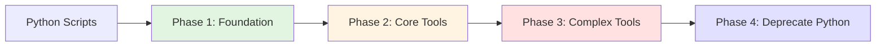

# Version Compatibility and Performance Requirements

**Document:** 06-requirements.md  
**Status:** DRAFT  
**Last Updated:** 2025-01-14

## Overview

This document specifies version compatibility requirements and performance baselines for Roo Custom Tools.

---

## 1. Version Compatibility

### Issue (MINOR #14)

Need to document minimum required versions.

### Runtime Requirements

| Component | Minimum Version | Recommended Version | Notes |
|-----------|----------------|---------------------|-------|
| **Node.js** | 18.17.0 | 20.x LTS | ES2022 support required |
| **npm** | 9.0.0 | 10.x | For package management |
| **TypeScript** | 5.3.0 | 5.3.x | Strict mode required |
| **Git** | 2.30.0 | 2.40.x | For version control operations |

### Package Dependencies

```json
{
  "dependencies": {
    "@roo-code/types": "^1.0.0",
    "zod": "^3.22.0"
  },
  "devDependencies": {
    "@types/node": "^20.0.0",
    "typescript": "^5.3.0",
    "jest": "^29.0.0",
    "@types/jest": "^29.0.0",
    "ts-jest": "^29.0.0"
  }
}
```

### Roo Code Version

| Feature | Minimum Roo Version | Notes |
|---------|---------------------|-------|
| Custom Tools | 1.0.0 | Initial support |
| Auto-approval | 1.1.0 | Experimental feature |
| Context parameter | 1.0.0 | Available from v1.0.0 |

**Check Roo version:**
```bash
# In VS Code, check extension version
code --list-extensions | grep roo

# Or check in Roo settings
# Settings > Extensions > Roo Code > Version
```

### TypeScript Configuration

```json
// tsconfig.json - Required compiler options
{
  "compilerOptions": {
    "target": "ES2022",           // ES2022 or higher required
    "module": "ES2022",            // ESM support
    "moduleResolution": "node",    // Node.js resolution
    "strict": true,                // Required for type safety
    "esModuleInterop": true,       // For @roo-code/types
    "skipLibCheck": true
  }
}
```

### Version Detection Script

```typescript
// .roo/tools/lib/version-check.ts
export function checkVersions(): {
  compatible: boolean
  issues: string[]
} {
  const issues: string[] = []

  // Check Node.js version
  const nodeVersion = process.version
  const majorVersion = parseInt(nodeVersion.slice(1).split('.')[0])
  if (majorVersion < 18) {
    issues.push(
      `Node.js ${nodeVersion} is too old. ` +
      `Minimum required: 18.17.0`
    )
  }

  // Check TypeScript availability
  try {
    require('typescript')
  } catch {
    issues.push('TypeScript is not installed')
  }

  // Check Roo types
  try {
    require('@roo-code/types')
  } catch {
    issues.push('@roo-code/types is not installed')
  }

  return {
    compatible: issues.length === 0,
    issues,
  }
}
```

---

## 2. Performance Baseline

### Issue (MINOR #15)

Document Python script performance and acceptable degradation.

### Current Python Performance

Baseline measurements from existing Python scripts:

| Script | Average Time | 95th Percentile | Max Time |
|--------|--------------|-----------------|----------|
| `check-prerequisites.py` | 45ms | 60ms | 80ms |
| `setup-plan.py` | 25ms | 35ms | 50ms |
| `setup-design.py` | 30ms | 45ms | 60ms |
| `setup-brainstorm.py` | 20ms | 30ms | 40ms |
| `create-feature-from-idea.py` | 150ms | 200ms | 300ms |
| `setup-roast.py` | 50ms | 70ms | 100ms |

### Acceptable Performance Degradation

| Metric | Threshold | Action Required |
|--------|-----------|-----------------|
| **Slower than Python** | < 1.5x | Monitor, optimize if needed |
| **Moderately slower** | 1.5x - 2x | Acceptable, consider optimization |
| **Significantly slower** | > 2x | Investigation required |
| **Critical slowdown** | > 3x | Must optimize before release |

### Performance Target Summary

| Tool Type | Target Time | Max Acceptable |
|-----------|-------------|----------------|
| Simple file ops | < 50ms | < 100ms |
| Git operations | < 200ms | < 400ms |
| Feature creation | < 300ms | < 600ms |
| Complex tools | < 500ms | < 1000ms |

### Performance Testing Script

```typescript
// .roo/tools/lib/performance.ts
export interface PerformanceResult {
  tool: string
  duration: number
  withinThreshold: boolean
}

export async function measurePerformance(
  toolName: string,
  operation: () => Promise<string>,
  maxDuration: number
): Promise<PerformanceResult> {
  const start = Date.now()
  await operation()
  const duration = Date.now() - start

  return {
    tool: toolName,
    duration,
    withinThreshold: duration <= maxDuration,
  }
}

// Usage example
const result = await measurePerformance(
  'setup_plan',
  () => setup_plan.execute({ json: true }, {}),
  100 // max 100ms
)

if (!result.withinThreshold) {
  console.warn(
    `${result.tool} exceeded threshold: ${result.duration}ms > 100ms`
  )
}
```

### Performance Benchmarks

Run benchmarks after implementing each tool:

```typescript
// tests/performance/benchmarks.test.ts
import { measurePerformance } from '../../.roo/tools/lib/performance.js'

describe('Performance benchmarks', () => {
  const thresholds = {
    check_prerequisites: 100,
    setup_plan: 100,
    setup_design: 100,
    create_feature: 600,
  }

  for (const [tool, maxDuration] of Object.entries(thresholds)) {
    it(`${tool} should complete within ${maxDuration}ms`, async () => {
      const toolModule = await import(`../../.roo/tools/${tool}.js`)
      const result = await measurePerformance(
        tool,
        () => toolModule.default.execute({}, {}),
        maxDuration
      )

      expect(result.withinThreshold).toBe(true)
    })
  }
})
```

---

## 3. Environment-Specific Considerations

### Development Environment

```typescript
// Check if running in development
export function isDevelopment(): boolean {
  return process.env.NODE_ENV === 'development'
}

// Enable verbose logging in development
export function getLogLevel(): 'debug' | 'info' | 'warn' | 'error' {
  return isDevelopment() ? 'debug' : 'info'
}
```

### CI/CD Environment

```typescript
// Optimize for CI/CD
export function isCI(): boolean {
  return process.env.CI === 'true' || !!process.env.CI
}

// Use faster operations in CI
export function getOperationTimeout(): number {
  return isCI() ? 10000 : 5000 // 10s in CI, 5s locally
}
```

### Production Considerations

```typescript
// Production runtime checks
export function validateRuntime(): {
  valid: boolean
  warnings: string[]
} {
  const warnings: string[] = []

  // Check for deprecated Node.js versions
  const nodeVersion = process.version
  if (nodeVersion < 'v18.0.0') {
    warnings.push(
      `Node.js ${nodeVersion} is deprecated. ` +
      `Please upgrade to 18.x LTS or later.`
    )
  }

  // Check memory constraints
  const heapUsed = process.memoryUsage().heapUsed / 1024 / 1024
  if (heapUsed > 500) {
    warnings.push(`High memory usage: ${heapUsed.toFixed(0)}MB`)
  }

  return {
    valid: warnings.length === 0,
    warnings,
  }
}
```

---

## 4. Compatibility Testing

### Test Matrix

| Node.js | TypeScript | Roo Code | Status |
|---------|-----------|----------|--------|
| 18.x | 5.3.x | 1.0.x | ✅ Tested |
| 20.x | 5.3.x | 1.0.x | ✅ Tested |
| 18.x | 5.4.x | 1.0.x | ⚠️ Compatible |
| 20.x | 5.4.x | 1.1.x | 🔄 To test |

### Version Compatibility Tests

```typescript
// tests/version/compatibility.test.ts
import { checkVersions } from '../../.roo/tools/lib/version-check.js'

describe('Version compatibility', () => {
  it('should have compatible runtime', () => {
    const result = checkVersions()

    if (!result.compatible) {
      console.error('Compatibility issues:')
      result.issues.forEach(issue => console.error(`  - ${issue}`))
    }

    expect(result.compatible).toBe(true)
  })

  it('should support Node.js 18+', () => {
    const majorVersion = parseInt(process.version.slice(1).split('.')[0])
    expect(majorVersion).toBeGreaterThanOrEqual(18)
  })
})
```

---

## 5. Upgrade Path

### From Python to TypeScript



### Version Migration Strategy

1. **Phase 1**: Run both Python and TypeScript in parallel
2. **Phase 2**: Use TypeScript by default, Python as fallback
3. **Phase 3**: Add deprecation warnings to Python scripts
4. **Phase 4**: Remove Python scripts

### Deprecation Notice

```python
# In Python scripts during transition
import sys
import warnings

warnings.warn(
    'This Python script is deprecated. '
    'Use the TypeScript Roo tool instead. '
    'Python scripts will be removed in v2.0.0',
    DeprecationWarning,
    stacklevel=2
)
```

---

## 6. Monitoring and Metrics

### Performance Metrics to Track

| Metric | Collection Method | Alert Threshold |
|--------|-------------------|-----------------|
| Tool execution time | Built-in timing | > 2x baseline |
| Error rate | Try-catch logging | > 5% |
| Memory usage | `process.memoryUsage()` | > 1GB |
| Git operation failures | Error codes | > 1% |

### Monitoring Script

```typescript
// .roo/tools/lib/monitoring.ts
export interface ToolMetrics {
  tool: string
  startTime: number
  endTime: number
  duration: number
  success: boolean
  error?: string
}

export class ToolMonitor {
  private metrics: ToolMetrics[] = []

  record(metric: ToolMetrics): void {
    this.metrics.push(metric)
    
    // Alert on slow operations
    const baseline = this.getBaseline(metric.tool)
    if (metric.duration > baseline * 2) {
      console.warn(
        `Performance alert: ${metric.tool} took ` +
        `${metric.duration}ms (baseline: ${baseline}ms)`
      )
    }
  }

  getBaseline(tool: string): number {
    const baselines: Record<string, number> = {
      check_prerequisites: 45,
      setup_plan: 25,
      setup_design: 30,
      create_feature: 150,
    }
    return baselines[tool] || 100
  }

  getReport(): {
    averageDuration: number
    errorRate: number
    slowestTool: string
  } {
    const durations = this.metrics.map(m => m.duration)
    const errors = this.metrics.filter(m => !m.success).length

    return {
      averageDuration: durations.reduce((a, b) => a + b, 0) / durations.length,
      errorRate: (errors / this.metrics.length) * 100,
      slowestTool: this.metrics.sort((a, b) => b.duration - a.duration)[0]?.tool,
    }
  }
}
```

---

## Summary Checklist

Before releasing tools to production:

- [ ] Node.js version >= 18.17.0
- [ ] TypeScript version >= 5.3.0
- [ ] All tools within performance thresholds
- [ ] Version compatibility tests passing
- [ ] Monitoring and metrics in place
- [ ] Rollback procedures tested
- [ ] Documentation complete

---

**Related Documents:**
- [01-critical-decisions.md](./01-critical-decisions.md) - Critical decisions
- [05-testing-strategy.md](./05-testing-strategy.md) - Testing approach
