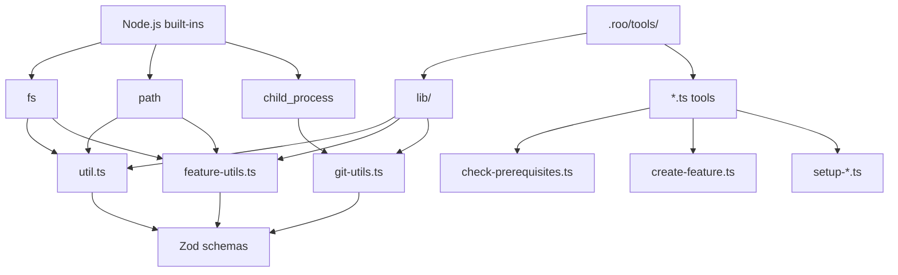

# Python to Roo Tools Migration Plan

**Document:** python-to-roo-tools-migration.md (Index)  
**Status:** MODULAR - See subdocuments below  
**Last Updated:** 2025-01-14

## Overview

This document provides a comprehensive migration strategy for converting Python scripts in `.zo/scripts/python/` to Roo Custom Tools. The analysis covers 16 Python scripts that support a Spec-Driven Development workflow.

**Migration documentation has been split into focused modules for easier review and implementation.**

---

## Quick Links to Documentation

### Getting Started

1. **[Critical Decisions](./migration/01-critical-decisions.md)** - Read first!
   - Shared utility import strategy
   - Template file management
   - Auto-approval security policy

### Implementation Guides

2. **[Code Standards](./migration/02-code-standards.md)**
   - Parameter destructuring patterns
   - Tool naming conventions
   - Documentation requirements

3. **[Complete Example](./migration/03-complete-example.md)**
   - Full working tool implementation
   - Shared utilities code
   - Configuration files
   - Test examples

4. **[Implementation Guide](./migration/04-implementation-guide.md)**
   - Context object utilization
   - Environment variable handling
   - Git operations error handling
   - File system operations
   - Zod schema best practices

### Quality Assurance

5. **[Testing Strategy](./migration/05-testing-strategy.md)**
   - Test framework specification
   - Mocking strategies
   - Test structure examples
   - Rollback procedures

6. **[Requirements](./migration/06-requirements.md)**
   - Version compatibility
   - Performance baselines
   - Monitoring and metrics

---

## Executive Summary

**Key Findings:**
- **16 Python scripts** identified for potential migration
- **12 core utility scripts** suitable for conversion to Roo tools
- **2 shared utility modules** require special handling
- **2 test/helper scripts** should remain as Python

**Migration Feasibility:** High - Most scripts are file-system oriented with clear input/output patterns.

---

## Scripts to Convert

### Convert to Roo Tools (9 tools)

| Python Script | TypeScript Tool | Priority | Complexity |
|---------------|-----------------|----------|------------|
| [`check-prerequisites.py`](../.zo/scripts/python/check-prerequisites.py) | `check-prerequisites.ts` | HIGH | Low |
| [`setup-plan.py`](../.zo/scripts/python/setup-plan.py) | `setup-plan.ts` | HIGH | Low |
| [`setup-design.py`](../.zo/scripts/python/setup-design.py) | `setup-design.ts` | HIGH | Low |
| [`setup-brainstorm.py`](../.zo/scripts/python/setup-brainstorm.py) | `setup-brainstorm.ts` | HIGH | Low |
| [`setup-roast-verify.py`](../.zo/scripts/python/setup-roast-verify.py) | `setup-roast-verify.ts` | HIGH | Low |
| [`setup-specify-idea.py`](../.zo/scripts/python/setup-specify-idea.py) | `setup-specify-idea.ts` | MEDIUM | Low |
| [`setup-roast.py`](../.zo/scripts/python/setup-roast.py) | `setup-roast.ts` | MEDIUM | Medium |
| [`setup-brainstorm-crazy.py`](../.zo/scripts/python/setup-brainstorm-crazy.py) | `setup-brainstorm-crazy.ts` | MEDIUM | Medium |
| [`create-feature-from-idea.py`](../.zo/scripts/python/create-feature-from-idea.py) + [`create-new-feature.py`](../.zo/scripts/python/create-new-feature.py) | `create-feature.ts` | MEDIUM | High |

### Convert to Shared Modules (2 modules)

| Python Script | TypeScript Module | Purpose |
|---------------|-------------------|---------|
| [`common.py`](../.zo/scripts/python/common.py) | `lib/util.ts` | Core utilities (git, path, validation) |
| [`feature_utils.py`](../.zo/scripts/python/feature_utils.py) | `lib/feature-utils.ts` | Feature creation utilities |

### Keep as Python (3 scripts)

| Python Script | Reason |
|---------------|--------|
| [`update-agent-context.py`](../.zo/scripts/python/update-agent-context.py) | Too complex, low value for Roo |
| [`update_task_status.py`](../.zo/scripts/python/update_task_status.py) | User-facing tool, not AI-facing |
| [`test_common.py`](../.zo/scripts/python/test_common.py) | Test infrastructure |

---

## Migration Roadmap

### Phase 1: Foundation
**Goal:** Set up infrastructure and migrate simplest tools

1. Setup TypeScript environment
2. Create shared utilities (`lib/util.ts`, `lib/feature-utils.ts`)
3. Migrate simple tools:
   - `setup-plan.ts`
   - `setup-design.ts`
   - `setup-brainstorm.ts`
   - `setup-roast-verify.ts`

**Success Criteria:** All tools compile, basic smoke tests pass.

### Phase 2: Core Workflow Tools
**Goal:** Migrate tools used in daily workflow

4. `check-prerequisites.ts`
5. `setup-roast.ts`
6. `setup-specify-idea.ts`
7. `setup-brainstorm-crazy.ts`

**Success Criteria:** Tools integrate with Roo modes, match Python behavior.

### Phase 3: Feature Creation Tools
**Goal:** Migrate complex feature creation logic

8. `create-feature.ts` (combined from 2 Python scripts)

**Success Criteria:** Feature creation matches Python output exactly.

### Phase 4: Testing & Documentation
**Goal:** Ensure parity and maintainability

9. Create test suite
10. Update documentation

**Success Criteria:** All tests pass, documentation complete.

---

## Architecture

---

## Dependencies to Replace

| Python Module | Node.js Replacement | Notes |
|--------------|---------------------|-------|
| `subprocess` | `child_process` | Use `execSync` for synchronous git commands |
| `pathlib` | `path` | `path.join()`, `path.resolve()`, `path.basename()` |
| `os` | `fs` | `fs.existsSync()`, `fs.mkdirSync()`, `fs.readFileSync()` |
| `os.environ` | `process.env` | Direct access |
| `shutil` | `fs` | `fs.copyFileSync()` |
| `json` | `JSON` | Built-in `JSON.parse()`, `JSON.stringify()` |
| `argparse` | `zod` | Zod schemas for parameter validation |
| `logging` | `console` | Or custom logger, or include in return string |
| `re` | Built-in RegExp | `/pattern/flags` syntax |
| `datetime` | `Date` | `new Date().toISOString()` etc. |

---

## Expected Benefits

- **Improved Integration:** Tools can be called directly by Roo without subprocess overhead
- **Type Safety:** TypeScript + Zod provide compile-time and runtime validation
- **Better Error Messages:** Structured error handling with clear messages for AI
- **Single Language:** Entire codebase in TypeScript/JavaScript
- **Auto-approval:** Experimental mode allows tools to run without confirmation

---

## Next Steps

1. **Review** the [Critical Decisions](./migration/01-critical-decisions.md) document
2. **Study** the [Complete Example](./migration/03-complete-example.md) to understand the pattern
3. **Follow** [Code Standards](./migration/02-code-standards.md) when implementing tools
4. **Reference** [Implementation Guide](./migration/04-implementation-guide.md) for specific patterns
5. **Implement** tests following [Testing Strategy](./migration/05-testing-strategy.md)
6. **Verify** [Requirements](./migration/06-requirements.md) are met

---

## Document Index

| Document | Focus | Issues Addressed |
|----------|-------|------------------|
| [01-critical-decisions.md](./migration/01-critical-decisions.md) | Architecture decisions | #2, #3, #4 |
| [02-code-standards.md](./migration/02-code-standards.md) | Coding standards | #1, #13, #16 |
| [03-complete-example.md](./migration/03-complete-example.md) | Full working example | #7 |
| [04-implementation-guide.md](./migration/04-implementation-guide.md) | Implementation details | #5, #8, #9, #10 |
| [05-testing-strategy.md](./migration/05-testing-strategy.md) | Testing approach | #11, #12, #15 |
| [06-requirements.md](./migration/06-requirements.md) | Version & performance | #14, #15 |

---

**Document Version:** 2.0 (Modular)  
**Previous Version:** 1.0 (Monolithic)  
**Status:** Ready for Implementation
