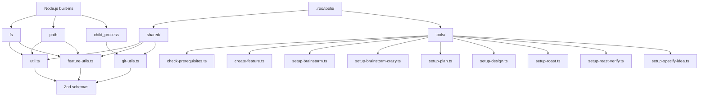

# Python to Roo Custom Tools Migration Plan

## Executive Summary

This document provides a comprehensive migration strategy for converting Python scripts in `.zo/scripts/python/` to Roo Custom Tools. The analysis covers 16 Python scripts that support a Spec-Driven Development workflow, including feature creation, prerequisite checking, documentation setup, and task management.

**Key Findings:**
- **16 Python scripts** identified for potential migration
- **12 core utility scripts** suitable for conversion to Roo tools
- **2 shared utility modules** ([`common.py`](.zo/scripts/python/common.py), [`feature_utils.py`](.zo/scripts/python/feature_utils.py)) require special handling
- **2 test/helper scripts** should remain as Python ([`test_common.py`](.zo/scripts/python/test_common.py), [`update_task_status.py`](.zo/scripts/python/update_task_status.py))

**Migration Feasibility:** High - Most scripts are file-system oriented with clear input/output patterns that map well to Roo's tool definition structure.

---

## Detailed Analysis by Script Category

### 1. Shared Utility Modules (Special Handling Required)

#### [`common.py`](.zo/scripts/python/common.py) (636 lines)
**Purpose:** Core utility functions for git operations, path resolution, feature detection, and file system validation.

**Feasibility:** PARTIAL - Should be converted to a shared TypeScript utility module, not a standalone tool.

**Key Functions:**
- `run_git_command()` - Git subprocess execution
- `has_git()`, `get_repo_root()`, `get_current_branch()` - Git repository operations
- `get_feature_paths()`, `find_feature_dir_by_prefix()` - Feature path resolution
- `check_file_exists()`, `check_dir_exists()` - File system validation
- `resolve_path()` - Path normalization with AI mistake handling
- `validate_execution_environment()` - Environment validation

**Dependencies:**
- `subprocess` - Replace with Node.js `child_process`
- `pathlib`, `os` - Replace with Node.js `path` module
- `logging` - Replace with custom logging or console output

**Recommendation:** Convert to `.roo/tools/shared/util.ts` - imported by other tools, not exposed as a standalone tool.

---

#### [`feature_utils.py`](.zo/scripts/python/feature_utils.py) (389 lines)
**Purpose:** Feature creation utilities including branch number detection, branch name generation, and git operations.

**Feasibility:** PARTIAL - Convert to shared TypeScript utility module.

**Key Functions:**
- `find_repo_root()` - Repository root detection
- `get_highest_from_specs()`, `get_highest_from_branches()` - Number detection
- `check_existing_branches()` - Next available number calculation
- `clean_branch_name()`, `generate_branch_name()` - Branch name generation
- `truncate_branch_name()` - GitHub limit handling (244 bytes)
- `create_git_branch()` - Git branch creation

**Dependencies:**
- `subprocess` - Replace with Node.js `child_process` for git commands
- `pathlib`, `os` - Replace with Node.js `path` module
- STOP_WORDS regex pattern - Port to TypeScript

**Recommendation:** Convert to `.roo/tools/shared/feature-utils.ts` - imported by feature creation tools.

---

### 2. Feature Creation Scripts

#### [`create-feature-from-idea.py`](.zo/scripts/python/create-feature-from-idea.py) (232 lines)
**Purpose:** Create new feature branch and spec file from a brainstorm idea.

**Feasibility:** HIGH - Well-suited for Roo tool conversion.

**Input Parameters:**
- `feature_description` (string, required) - Feature idea description
- `--json` (boolean, optional) - Output format
- `--short-name` (string, optional) - Custom branch name suffix
- `--number` (number, optional) - Manual feature number

**Output:**
```json
{
  "BRANCH_NAME": "001-user-auth",
  "SPEC_FILE": "/path/to/specs/001-user-auth/spec.md",
  "FEATURE_NUM": "001"
}
```

**Dependencies:**
- [`feature_utils.py`](.zo/scripts/python/feature_utils.py) - Branch detection, naming
- `shutil` - File copying (template → spec.md)
- Git operations via subprocess

**Technical Challenges:**
- Git branch creation via `child_process.execSync()`
- Template file copying with [`fs.readFileSync()`](https://nodejs.org/docs/latest-v20.x/api/fs.html#fsreadfilesyncpath-options) / [`fs.writeFileSync()`](https://nodejs.org/docs/latest-v20.x/api/fs.html#fswritefilesyncfile-data-options)
- Environment variable `SPECIFY_FEATURE` - Set via `process.env.SPECIFY_FEATURE = ...` (Note: doesn't affect parent process)

**Complexity:** Medium

---

#### [`create-new-feature.py`](.zo/scripts/python/create-new-feature.py) (240 lines)
**Purpose:** Create new feature branch and spec file from user description (similar to above, uses different template).

**Feasibility:** HIGH - Nearly identical to [`create-feature-from-idea.py`](.zo/scripts/python/create-feature-from-idea.py).

**Key Difference:** Uses `spec-template.md` instead of `spec-from-idea.md`.

**Recommendation:** COMBINE with [`create-feature-from-idea.py`](.zo/scripts/python/create-feature-from-idea.py) into a single tool with a `template` parameter.

---

### 3. Prerequisite Checking Scripts

#### [`check-prerequisites.py`](.zo/scripts/python/check-prerequisites.py) (295 lines)
**Purpose:** Validate feature prerequisites (branch, files, directories) and report available documentation.

**Feasibility:** HIGH - Excellent candidate for Roo tool.

**Input Parameters:**
- `--json` (boolean, optional) - Output format
- `--require-tasks` (boolean, optional) - Require tasks.md
- `--include-tasks` (boolean, optional) - Include tasks.md in output
- `--paths-only` (boolean, optional) - Only output paths, no validation

**Output:**
```json
{
  "FEATURE_DIR": "/path/to/specs/001-feature",
  "AVAILABLE_DOCS": ["research.md", "data-model.md", "design.md"]
}
```

**Dependencies:**
- [`common.py`](.zo/scripts/python/common.py) - Path resolution, validation

**Use Case:** Called by Roo modes to validate environment before operations.

**Complexity:** Low

---

### 4. Documentation Setup Scripts

#### [`setup-brainstorm.py`](.zo/scripts/python/setup-brainstorm.py) (192 lines)
**Purpose:** Initialize brainstorm session file in `.zo/brainstorms/`.

**Feasibility:** HIGH - Simple file creation with template.

**Input Parameters:**
- `topic` (string, optional) - Brainstorm topic
- `--json` (boolean, optional) - Output format

**Output:**
```json
{
  "OUTPUT_FILE": "/path/to/.zo/brainstorms/topic-2024-01-15-1430.md",
  "BRAINSTORM_DIR": "/path/to/.zo/brainstorms",
  "TOPIC": "topic-slug"
}
```

**Dependencies:**
- [`common.py`](.zo/scripts/python/common.py) - `get_repo_root()`
- Template: `.zo/templates/brainstorm-template.md`

**Complexity:** Low

---

#### [`setup-brainstorm-crazy.py`](.zo/scripts/python/setup-brainstorm-crazy.py) (396 lines)
**Purpose:** Initialize "crazy" brainstorm session with context awareness (finds related spec files).

**Feasibility:** MEDIUM - More complex logic for spec folder matching.

**Input Parameters:**
- `request` (string, required) - Brainstorm request text
- `--json` (boolean, optional) - Output format (default: true)
- `--dry-run` (boolean, optional) - Show what would be done
- `-v, --verbose` (boolean, optional) - Verbose output

**Output:**
```json
{
  "OUTPUT_FILE": "/path/to/.zo/brainstorms/keywords-2024-01-15.md",
  "FEATURE_SPEC": "/path/to/specs/001-feature/spec.md",
  "IMPL_PLAN": "/path/to/specs/001-feature/plan.md",
  "TASKS": "/path/to/specs/001-feature/tasks.md",
  "RESEARCH_FOCUS": "keyword1-keyword2",
  "SPEC_DIR": "/path/to/specs/001-feature"
}
```

**Key Logic:**
- Extract keywords from input (remove stop words)
- Find matching spec folder by keyword scoring
- Locate related spec.md, plan.md, tasks.md files
- Enhanced template with context

**Dependencies:**
- [`common.py`](.zo/scripts/python/common.py) - `get_repo_root()`, `check_file_exists()`
- Template: `.zo/templates/brainstorm-template-crazy.md`

**Complexity:** Medium

---

#### [`setup-design.py`](.zo/scripts/python/setup-design.py) (259 lines)
**Purpose:** Initialize design documentation (global or feature-specific).

**Feasibility:** HIGH - Two-mode operation (global/feature).

**Input Parameters:**
- `--global` (boolean, optional) - Setup global design system
- `feature_dir` (string, optional) - Feature directory path
- `--json` (boolean, optional) - Output format

**Output:**
```json
{
  "MODE": "feature",
  "DESIGN_FILE": "/path/to/feature/design.md",
  "FEATURE_SPEC": "/path/to/feature/spec.md",
  "FEATURE_DIR": "/path/to/feature",
  "FEATURE_NAME": "001-feature"
}
```

**Dependencies:**
- [`common.py`](.zo/scripts/python/common.py) - Path resolution, branch detection
- Templates: `design-system-template.md`, `design-template.md`

**Complexity:** Low

---

#### [`setup-plan.py`](.zo/scripts/python/setup-plan.py) (149 lines)
**Purpose:** Initialize implementation plan (plan.md) for current feature.

**Feasibility:** HIGH - Simple template copying.

**Input Parameters:**
- `--json` (boolean, optional) - Output format

**Output:**
```json
{
  "FEATURE_SPEC": "/path/to/feature/spec.md",
  "IMPL_PLAN": "/path/to/feature/plan.md",
  "DESIGN_FILE": "/path/to/feature/design.md",
  "SPECS_DIR": "/path/to/feature",
  "BRANCH": "001-feature",
  "HAS_GIT": "true"
}
```

**Dependencies:**
- [`common.py`](.zo/scripts/python/common.py) - `get_feature_paths()`
- Template: `.zo/templates/plan-template.md`

**Complexity:** Low

---

#### [`setup-roast.py`](.zo/scripts/python/setup-roast.py) (306 lines)
**Purpose:** Initialize roast report for code review.

**Feasibility:** MEDIUM - Complex JSON input parsing and path resolution.

**Input Parameters:**
- `--json` (boolean, optional) - Output format
- `--json=JSON_DATA` (string, optional) - JSON with commits array and design_system path
- `feature_dir` (string, optional) - Feature directory
- JSON object as positional arg (alternative format)

**Output:**
```json
{
  "REPORT_FILE": "/path/to/feature/roasts/roast-report-feature-2024-01-15-1430.md",
  "TASKS": "/path/to/feature/tasks.md",
  "IMPL_PLAN": "/path/to/feature/plan.md",
  "BRANCH": "001-feature",
  "COMMITS": "abc123,def456",
  "DESIGN_SYSTEM": "/path/to/.zo/design-system.md"
}
```

**Key Logic:**
- Parse JSON input from multiple formats
- Handle main/master branch special case
- Append metadata (commits, design system) to roast report
- Timestamp-based filename

**Dependencies:**
- [`common.py`](.zo/scripts/python/common.py) - `get_feature_paths()`
- Template: `.zo/templates/roast-template.md`

**Complexity:** Medium

---

#### [`setup-roast-verify.py`](.zo/scripts/python/setup-roast-verify.py) (240 lines)
**Purpose:** Verify and locate latest roast report for a feature.

**Feasibility:** HIGH - File finding with glob patterns.

**Input Parameters:**
- `--json` (boolean, optional) - Output format
- `--report` (string, optional) - Specific report file path
- `feature_dir` (string, optional) - Feature directory

**Output:**
```json
{
  "REPORT_FILE": "/path/to/feature/roasts/roast-report-feature-2024-01-15-1430.md",
  "TASKS": "/path/to/feature/tasks.md",
  "BRANCH": "001-feature"
}
```

**Key Logic:**
- Find latest roast report by modification time
- Pattern: `roast-report-{FEATURE_NAME}-*.md`
- Fallback to user-specified report path

**Dependencies:**
- [`common.py`](.zo/scripts/python/common.py) - `get_feature_paths()`
- Node.js `fs` with glob support

**Complexity:** Low

---

#### [`setup-specify-idea.py`](.zo/scripts/python/setup-specify-idea.py) (180 lines)
**Purpose:** Find brainstorm file and spec template for spec creation.

**Feasibility:** HIGH - File searching with fallback locations.

**Input Parameters:**
- `brainstorm_file` (string, optional) - Specific brainstorm file path
- `--json` (boolean, optional) - Output format

**Output:**
```json
{
  "BRAINSTORM_FILE": "/path/to/.zo/brainstorms/latest.md",
  "SPEC_TEMPLATE": "/path/to/.zo/templates/spec-from-idea.md",
  "DESIGN_FILE": "/path/to/feature/design.md"
}
```

**Key Logic:**
- Search order: user path → `.zo/brainstorms/` → `FEATURE_DIR/brainstorms/` → `docs/brainstorms/`
- Find most recently modified .md file

**Dependencies:**
- [`common.py`](.zo/scripts/python/common.py) - Path resolution

**Complexity:** Low

---

### 5. Task Management Scripts

#### [`update-agent-context.py`](.zo/scripts/python/update-agent-context.py) (809 lines)
**Purpose:** Update AI agent context files (CLAUDE.md, GEMINI.md, etc.) with plan.md information.

**Feasibility:** MEDIUM - Complex file parsing and template substitution.

**Input Parameters:**
- `agent_type` (string, optional) - Specific agent to update (claude|gemini|copilot|etc.)
- Leave empty to update all existing agent files

**Output:** Success/failure messages via logging

**Key Logic:**
- Parse plan.md to extract language, framework, database, project type
- Generate technology stack strings
- Create new agent files from template or update existing files
- Preserve manual additions in existing files
- Update "Active Technologies" and "Recent Changes" sections
- Handle 15+ different agent file formats

**Dependencies:**
- [`common.py`](.zo/scripts/python/common.py) - Path resolution
- Template: `.zo/templates/agent-file-template.md`
- Complex file manipulation (atomic updates with temp files)

**Complexity:** High

**Recommendation:** Consider whether this is needed as a Roo tool - it's primarily for maintaining agent context files, which Roo itself might not need to call directly.

---

#### [`update_task_status.py`](.zo/scripts/python/update_task_status.py) (361 lines)
**Purpose:** Mark tasks as completed in tasks.md files.

**Feasibility:** HIGH - Well-defined pattern matching and file updates.

**Input Parameters:**
- `tasks_file` (string, required) - Path to tasks.md
- `task_ids` (string[], required) - Task IDs to complete (supports ranges: T001-T005)
- `--dry-run` (boolean, optional) - Preview changes
- `--verbose` (boolean, optional) - Detailed output

**Output:** Summary of updated/not found/already done tasks

**Key Logic:**
- Parse task ranges (T001-T005 expands to T001, T002, T003, T004, T005)
- Normalize task IDs ([T001] → T001, task_T001 → T001)
- Find tasks by pattern: `- [ ] T001` or `- [x] T001`
- Update from `- [ ]` to `- [x]`
- Batch updates with reporting

**Dependencies:**
- [`common.py`](.zo/scripts/python/common.py) - Path resolution, task ID normalization

**Complexity:** Medium

**Recommendation:** **KEEP AS PYTHON** - This script is specifically designed to be called by users/CI systems, not by Roo. Task status updates are human-driven workflows.

---

### 6. Test/Helper Scripts

#### [`test_common.py`](.zo/scripts/python/test_common.py) (75 lines)
**Purpose:** Test utilities for comparing bash and Python script outputs.

**Feasibility:** N/A - Testing infrastructure.

**Recommendation:** **KEEP AS PYTHON** - Part of test infrastructure, not a production script.

---

## Recommended Tool Groupings

### High-Priority Individual Tools

1. **`check-prerequisites`** - Environment validation (called by modes before operations)
2. **`setup-brainstorm`** - Simple brainstorm initialization
3. **`setup-plan`** - Implementation plan creation
4. **`setup-design`** - Design documentation setup
5. **`setup-roast`** - Roast report initialization
6. **`setup-roast-verify`** - Roast report verification
7. **`setup-specify-idea`** - Brainstorm file discovery

### Combined Tools

8. **`create-feature`** - Combine [`create-feature-from-idea.py`](.zo/scripts/python/create-feature-from-idea.py) + [`create-new-feature.py`](.zo/scripts/python/create-new-feature.py)
   - Parameters: `description`, `template` (idea|full), `shortName`, `number`
   - Reduces code duplication

9. **`setup-brainstorm-crazy`** - Keep separate due to unique context-aware logic

### Shared Utility Modules (Not Tools)

10. **`util.ts`** - Convert [`common.py`](.zo/scripts/python/common.py) core functions
11. **`feature-utils.ts`** - Convert [`feature_utils.py`](.zo/scripts/python/feature_utils.py)

### Keep as Python

12. **`update-agent-context`** - Too complex, low value for Roo to call
13. **`update-task-status`** - User-facing tool, not AI-facing
14. **`test_common`** - Test infrastructure

---

## Technical Implementation Strategy

### Architecture Design



### File Structure

```
.roo/tools/
├── package.json
├── tsconfig.json
├── shared/
│   ├── util.ts              # Common utilities (from common.py)
│   ├── feature-utils.ts     # Feature utilities (from feature_utils.py)
│   ├── git-utils.ts         # Git operations
│   └── types.ts             # Shared TypeScript types
├── tools/
│   ├── check-prerequisites.ts
│   ├── create-feature.ts
│   ├── setup-brainstorm.ts
│   ├── setup-brainstorm-crazy.ts
│   ├── setup-plan.ts
│   ├── setup-design.ts
│   ├── setup-roast.ts
│   ├── setup-roast-verify.ts
│   └── setup-specify-idea.ts
└── templates/
    └── (reference to .zo/templates/)
```

### Parameter Mapping: Python argparse → Zod Schema

#### Example: [`check-prerequisites.py`](.zo/scripts/python/check-prerequisites.py) → Zod

**Python argparse:**
```python
parser.add_argument('--json', action='store_true')
parser.add_argument('--require-tasks', action='store_true')
parser.add_argument('--include-tasks', action='store_true')
parser.add_argument('--paths-only', action='store_true')
```

**Zod Schema:**
```typescript
import { parametersSchema as z } from '@roo-code/types'

export default defineCustomTool({
  name: 'check_prerequisites',
  description: 'Check feature prerequisites and available documentation',
  parameters: z.object({
    json: z.boolean().optional().describe('Output in JSON format'),
    requireTasks: z.boolean().optional().describe('Require tasks.md to exist'),
    includeTasks: z.boolean().optional().describe('Include tasks.md in output'),
    pathsOnly: z.boolean().optional().describe('Only output paths, no validation'),
  }),
  async execute(args, context) {
    // Implementation
  }
})
```

### Git Operations: Python subprocess → Node.js child_process

**Python:**
```python
def run_git_command(args: list) -> Optional[str]:
    result = subprocess.run(
        ['git'] + args,
        capture_output=True,
        text=True,
        timeout=5
    )
    if result.returncode == 0:
        return result.stdout.strip()
    return None
```

**TypeScript:**
```typescript
import { execSync } from 'child_process'

function runGitCommand(args: string[]): string | null {
  try {
    const result = execSync(`git ${args.join(' ')}`, {
      encoding: 'utf-8',
      stdio: ['pipe', 'pipe', 'pipe'],
      timeout: 5000,
    })
    return result.trim()
  } catch (error) {
    return null
  }
}
```

### File System Operations

**Python → TypeScript Mapping:**

| Python | Node.js |
|--------|---------|
| `os.path.exists()` | `fs.existsSync()` |
| `os.path.isfile()` | `fs.statSync(path).isFile()` |
| `os.path.isdir()` | `fs.statSync(path).isDirectory()` |
| `os.makedirs(path, exist_ok=True)` | `fs.mkdirSync(path, { recursive: true })` |
| `shutil.copy()` | `fs.copyFileSync()` |
| `Path(path).resolve()` | `path.resolve()` |
| `os.environ.get()` | `process.env` |

### Error Handling Patterns

**Python:**
```python
if not os.path.isfile(feature_dir):
    print(f"ERROR: Feature directory not found: {feature_dir}", file=sys.stderr)
    sys.exit(1)
```

**TypeScript (Roo Tool):**
```typescript
async execute(args, context) {
  const featureDir = resolveFeaturePath(args.featureDir)
  
  if (!fs.existsSync(featureDir)) {
    return `ERROR: Feature directory not found: ${featureDir}`
  }
  
  // Continue with success path
  return `SUCCESS: ...`
}
```

**Note:** Roo tools return string results, not exit codes. Error conditions should be communicated in the return string.

### Shared Utilities Conversion

#### [`common.py`](.zo/scripts/python/common.py) → `util.ts`

**Key conversions:**

```typescript
// workspace path detection
export function getWorkspacePath(): string {
  const pwd = process.env.PWD || ''
  const workspace = process.env.WORKSPACE || process.env.HOME || ''
  const cwd = process.cwd()
  
  if (pwd && fs.existsSync(pwd)) {
    return path.resolve(pwd)
  }
  
  return path.resolve(cwd)
}

// path resolution with AI mistake handling
export function resolvePath(taskFile: string): string {
  const workspace = getWorkspacePath()
  const originalPath = taskFile
  
  // Strip duplicate workspace prefix
  taskFile = stripDuplicateWorkspacePrefix(taskFile, workspace)
  
  // Try multiple locations if file doesn't exist
  if (!fs.existsSync(taskFile)) {
    const possiblePaths = [
      taskFile,
      path.join(workspace, taskFile),
      path.join(workspace, 'specs', path.basename(taskFile)),
      // ... more fallbacks
    ]
    
    for (const p of possiblePaths) {
      if (fs.existsSync(p)) {
        return path.resolve(p)
      }
    }
  }
  
  return path.resolve(taskFile)
}

// feature path resolution
export function getFeaturePaths(): Record<string, string> {
  const workspace = getWorkspacePath()
  const repoRoot = getRepoRoot()
  const currentBranch = getCurrentBranch()
  const hasGit = hasGitRepo()
  
  const featureDir = findFeatureDirByPrefix(repoRoot, currentBranch)
  
  return {
    REPO_ROOT: path.resolve(repoRoot),
    CURRENT_BRANCH: currentBranch,
    HAS_GIT: hasGit ? 'true' : 'false',
    FEATURE_DIR: path.resolve(featureDir),
    FEATURE_SPEC: path.resolve(path.join(featureDir, 'spec.md')),
    IMPL_PLAN: path.resolve(path.join(featureDir, 'plan.md')),
    TASKS: path.resolve(path.join(featureDir, 'tasks.md')),
    // ... more paths
  }
}
```

#### [`feature_utils.py`](.zo/scripts/python/feature_utils.py) → `feature-utils.ts`

**Key conversions:**

```typescript
// branch name generation
export function generateBranchName(description: string): string {
  const cleanName = description.toLowerCase()
    .replace(/[^a-z0-9]+/g, ' ')
    .trim()
  
  const words = cleanName.split(/\s+/)
  const meaningfulWords = words.filter(word => {
    if (word.length < 3) return false
    return !STOP_WORDS.has(word)
  })
  
  const maxWords = meaningfulWords.length === 4 ? 4 : 3
  return meaningfulWords.slice(0, maxWords).join('-')
}

// GitHub branch name truncation
export function truncateBranchName(branchName: string): string {
  const MAX_BRANCH_LENGTH = 244
  const byteLength = Buffer.byteLength(branchName, 'utf-8')
  
  if (byteLength <= MAX_BRANCH_LENGTH) {
    return branchName
  }
  
  const prefix = branchName.split('-')[0] + '-'
  const prefixBytes = Buffer.byteLength(prefix, 'utf-8')
  const maxSuffixBytes = MAX_BRANCH_LENGTH - prefixBytes
  const suffix = branchName.split('-').slice(1).join('-')
  
  // Truncate byte-by-byte
  const truncatedSuffix = Buffer.from(suffix, 'utf-8')
    .slice(0, maxSuffixBytes)
    .toString('utf-8')
    .replace(/-+$/, '')
  
  return prefix + truncatedSuffix
}
```

---

## Migration Roadmap / Priorities

### Phase 1: Foundation (Low-Hanging Fruit)

**Goal:** Set up infrastructure and migrate simplest tools.

1. **Setup TypeScript Environment**
   - Initialize `.roo/tools/package.json`
   - Configure `tsconfig.json` with strict mode
   - Install dependencies: `@roo-code/types`, `zod`, `@types/node`

2. **Create Shared Utilities**
   - Convert [`common.py`](.zo/scripts/python/common.py) → `shared/util.ts`
   - Convert [`feature_utils.py`](.zo/scripts/python/feature_utils.py) → `shared/feature-utils.ts`
   - Create `shared/git-utils.ts`
   - Create `shared/types.ts` with common interfaces

3. **Migrate Simple Setup Tools**
   - `setup-plan.ts` - Template copying only
   - `setup-design.ts` - Two-mode, but straightforward
   - `setup-brainstorm.ts` - Simple file creation
   - `setup-roast-verify.ts` - File finding with glob

**Success Criteria:** All tools compile, basic smoke tests pass.

---

### Phase 2: Core Workflow Tools

**Goal:** Migrate tools used in daily workflow.

4. **`check-prerequisites.ts`** - Environment validation
   - Critical for mode operations
   - Multiple output formats

5. **`setup-roast.ts`** - Roast report initialization
   - Complex JSON input parsing
   - Special branch handling

6. **`setup-specify-idea.ts`** - Brainstorm file discovery
   - Multi-location search
   - Latest file detection

7. **`setup-brainstorm-crazy.ts`** - Context-aware brainstorm
   - Spec folder matching logic
   - Enhanced template support

**Success Criteria:** Tools integrate with Roo modes, match Python behavior.

---

### Phase 3: Feature Creation Tools

**Goal:** Migrate complex feature creation logic.

8. **`create-feature.ts`** - Combined feature creation
   - Merge [`create-feature-from-idea.py`](.zo/scripts/python/create-feature-from-idea.py) + [`create-new-feature.py`](.zo/scripts/python/create-new-feature.py)
   - Git branch creation
   - Template selection
   - Branch number detection

**Success Criteria:** Feature creation matches Python output exactly.

---

### Phase 4: Testing & Documentation

**Goal:** Ensure parity and maintainability.

9. **Create Test Suite**
   - Unit tests for shared utilities
   - Integration tests for each tool
   - Comparison tests (TypeScript vs Python output)

10. **Documentation**
    - Update Roo tools documentation
    - Create migration guide for contributors
    - Document any behavioral differences

**Success Criteria:** All tests pass, documentation complete.

---

### Migration Priority Matrix

| Tool | Complexity | Dependencies | Priority | Phase |
|------|-----------|--------------|----------|-------|
| `setup-plan` | Low | util.ts | **HIGH** | 1 |
| `setup-design` | Low | util.ts | **HIGH** | 1 |
| `setup-brainstorm` | Low | util.ts | **HIGH** | 1 |
| `setup-roast-verify` | Low | util.ts | **HIGH** | 1 |
| `check-prerequisites` | Low | util.ts | **HIGH** | 2 |
| `setup-specify-idea` | Low | util.ts, feature-utils.ts | **MEDIUM** | 2 |
| `setup-roast` | Medium | util.ts, git-utils.ts | **MEDIUM** | 2 |
| `setup-brainstorm-crazy` | Medium | util.ts | **MEDIUM** | 2 |
| `create-feature` | High | feature-utils.ts, git-utils.ts | **MEDIUM** | 3 |

---

## Risks and Mitigations

### Risk 1: Git Operation Failures

**Risk:** Node.js `child_process` may behave differently than Python `subprocess`, especially with git commands.

**Impact:** HIGH - Could break branch creation, repository detection.

**Mitigation:**
- Create comprehensive `git-utils.ts` with error handling
- Add fallback logic for non-git repositories
- Write extensive tests for git operations
- Document git version requirements

**Testing Strategy:**
- Test with git 2.x and 3.x
- Test in non-git directories
- Test with various repository states (detached HEAD, bare repo, etc.)

---

### Risk 2: Path Resolution Differences

**Risk:** Node.js `path` module may handle edge cases differently than Python `pathlib`.

**Impact:** MEDIUM - Could cause file not found errors.

**Mitigation:**
- Port the AI mistake handling logic from [`common.py`](.zo/scripts/python/common.py)
- Add extensive tests for path resolution edge cases
- Use `path.resolve()` consistently
- Document path resolution behavior

**Testing Strategy:**
- Test with duplicate workspace prefixes
- Test with relative paths
- Test with absolute paths
- Test with non-existent paths (fallback behavior)

---

### Risk 3: Template File Dependencies

**Risk:** Tools assume template files exist at specific paths (`.zo/templates/*.md`).

**Impact:** MEDIUM - Tools will fail silently or with unclear errors if templates missing.

**Mitigation:**
- Add template existence validation
- Provide clear error messages when templates missing
- Consider bundling minimal default templates in tool package
- Document template requirements

---

### Risk 4: Performance Degradation

**Risk:** Node.js/TypeScript may be slower than Python for file system operations.

**Impact:** LOW - Tools are called infrequently, not in hot loops.

**Mitigation:**
- Profile TypeScript tools vs Python scripts
- Optimize file system operations (batch reads, minimize stats)
- Use synchronous operations where appropriate (Roo tools are async but can use sync FS)
- Consider caching for expensive operations (git branch listing)

---

### Risk 5: Environment Variable Handling

**Risk:** Python scripts use `os.environ.get()` for configuration, Node.js uses `process.env`.

**Impact:** LOW - Straightforward conversion.

**Mitigation:**
- Document required environment variables
- Provide defaults for optional variables
- Validate environment variables on tool load

---

### Risk 6: Zod Schema Validation Errors

**Risk:** Zod schemas may be too strict or too permissive, causing validation failures or runtime errors.

**Impact:** MEDIUM - Could prevent tools from being called by Roo.

**Mitigation:**
- Test schemas with various input formats
- Use `.optional()` and `.default()` appropriately
- Provide clear `.describe()` text for AI
- Add runtime validation in execute() function as fallback

---

### Risk 7: Breaking Existing Workflows

**Risk:** Converting Python scripts to Roo tools may break existing user workflows that call these scripts directly.

**Impact:** HIGH - Users may have automation, CI/CD, or aliases calling Python scripts.

**Mitigation:**
- **Keep Python scripts in place** - Don't remove them
- Document migration path for users
- Consider maintaining Python scripts as "legacy" for backwards compatibility
- Add deprecation notices to Python scripts
- Create wrapper script that calls Roo tool (if needed)

**Recommendation:** Maintain both Python and TypeScript versions during transition period.

---

### Risk 8: Tool Result Format Changes

**Risk:** Roo tools return string results, Python scripts print to stdout and exit with codes.

**Impact:** MEDIUM - Calling code may expect specific exit codes or JSON parsing.

**Mitigation:**
- Standardize result formats (JSON for structured data)
- Include error information in result string (not exit codes)
- Document result format for each tool
- Consider returning both success/failure and data in JSON format

---

### Risk 9: TypeScript Compilation Errors

**Risk:** Type errors may prevent tools from loading.

**Impact:** LOW - Caught at development time.

**Mitigation:**
- Use `strict: true` in tsconfig.json
- Enable all type checking options
- Run `tsc --noEmit` in pre-commit hook
- Use `@types/node` for Node.js types

---

### Risk 10: Loss of Python Testing Infrastructure

**Risk:** Existing Python tests (`tests/python/`) won't test TypeScript tools.

**Impact:** MEDIUM - Reduced test coverage during migration.

**Mitigation:**
- Create new test suite for TypeScript tools
- Consider keeping Python tests for comparison testing
- Add tests that compare Python vs TypeScript output
- Use snapshot testing for output consistency

---

## Dependencies to Replace

| Python Module | Node.js Replacement | Notes |
|--------------|---------------------|-------|
| `subprocess` | `child_process` | Use `execSync` for synchronous git commands |
| `pathlib` | `path` | `path.join()`, `path.resolve()`, `path.basename()` |
| `os` | `fs` | `fs.existsSync()`, `fs.mkdirSync()`, `fs.readFileSync()` |
| `os.environ` | `process.env` | Direct access |
| `shutil` | `fs` | `fs.copyFileSync()` |
| `json` | `JSON` | Built-in `JSON.parse()`, `JSON.stringify()` |
| `argparse` | `zod` | Zod schemas for parameter validation |
| `logging` | `console` | Or custom logger, or include in return string |
| `re` | Built-in RegExp | `/pattern/flags` syntax |
| `datetime` | `Date` | `new Date().toISOString()` etc. |
| `tempfile` | `fs` + `crypto` | `fs.mkdtemp()` with random suffix |

---

## Conclusion / Recommendation

### Overall Feasibility: **HIGH**

The Python scripts are well-structured, primarily file-system oriented, and have clear input/output patterns. This makes them excellent candidates for conversion to Roo Custom Tools.

### Recommended Approach:

1. **Start with shared utilities** - Convert [`common.py`](.zo/scripts/python/common.py) and [`feature_utils.py`](.zo/scripts/python/feature_utils.py) to TypeScript modules first.

2. **Migrate in phases** - Follow the roadmap above, starting with simplest tools.

3. **Maintain Python scripts** - Keep originals during transition for backwards compatibility.

4. **Focus on parity** - Ensure TypeScript tools produce identical output to Python scripts.

5. **Comprehensive testing** - Create test suite that compares Python vs TypeScript output.

6. **Document thoroughly** - Maintain clear documentation of tool behavior and usage.

### Scripts to Convert (12 total):

**Convert to Roo Tools:**
1. [`check-prerequisites.py`](.zo/scripts/python/check-prerequisites.py) → `check-prerequisites.ts`
2. [`setup-brainstorm.py`](.zo/scripts/python/setup-brainstorm.py) → `setup-brainstorm.ts`
3. [`setup-brainstorm-crazy.py`](.zo/scripts/python/setup-brainstorm-crazy.py) → `setup-brainstorm-crazy.ts`
4. [`setup-design.py`](.zo/scripts/python/setup-design.py) → `setup-design.ts`
5. [`setup-plan.py`](.zo/scripts/python/setup-plan.py) → `setup-plan.ts`
6. [`setup-roast.py`](.zo/scripts/python/setup-roast.py) → `setup-roast.ts`
7. [`setup-roast-verify.py`](.zo/scripts/python/setup-roast-verify.py) → `setup-roast-verify.ts`
8. [`setup-specify-idea.py`](.zo/scripts/python/setup-specify-idea.py) → `setup-specify-idea.ts`
9. [`create-feature-from-idea.py`](.zo/scripts/python/create-feature-from-idea.py) + [`create-new-feature.py`](.zo/scripts/python/create-new-feature.py) → `create-feature.ts`

**Convert to Shared Modules:**
10. [`common.py`](.zo/scripts/python/common.py) → `shared/util.ts`
11. [`feature_utils.py`](.zo/scripts/python/feature_utils.py) → `shared/feature-utils.ts`

### Keep as Python (3 total):

12. [`update-agent-context.py`](.zo/scripts/python/update-agent-context.py) - Too complex, low value for Roo
13. [`update_task_status.py`](.zo/scripts/python/update_task_status.py) - User-facing tool
14. [`test_common.py`](.zo/scripts/python/test_common.py) - Test infrastructure

### Expected Benefits:

- **Improved Integration:** Tools can be called directly by Roo without subprocess overhead
- **Type Safety:** TypeScript + Zod provide compile-time and runtime validation
- **Better Error Messages:** Structured error handling with clear messages for AI
- **Single Language:** Entire codebase in TypeScript/JavaScript
- **Auto-approval:** Experimental mode allows tools to run without confirmation

### Next Steps:

1. Review and approve this migration plan
2. Set up development environment (`.roo/tools/package.json`)
3. Begin Phase 1: Foundation (shared utilities + simple tools)
4. Create comparison tests to verify parity
5. Iterate based on testing feedback

---

**Document Version:** 1.0  
**Last Updated:** 2025-01-14  
**Author:** Migration Analysis  
**Status:** Ready for Review
