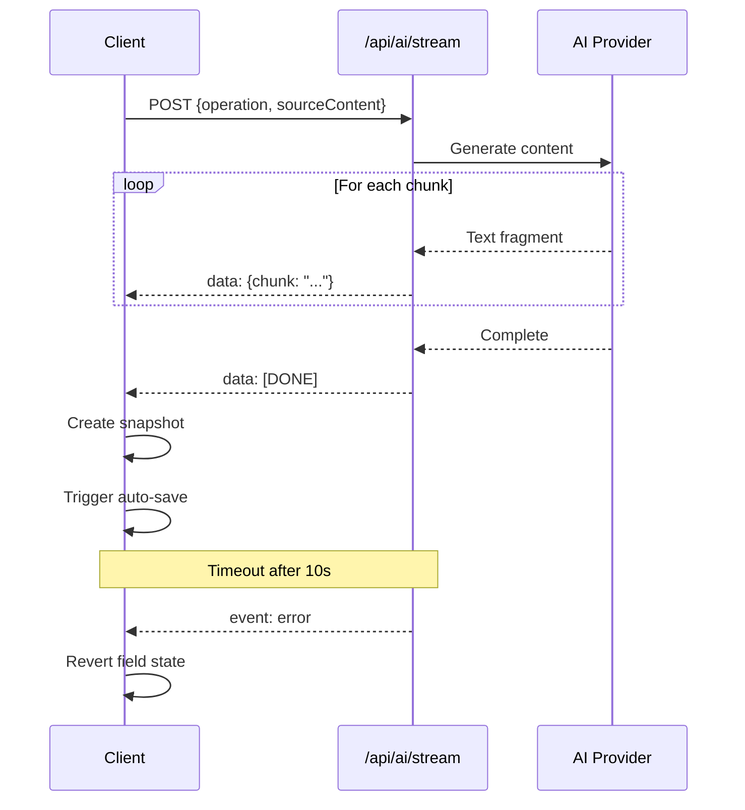

# API Contract: AI Streaming (SSE)

**Feature**: 007-contextual-ai-integration
**Endpoint**: `POST /api/ai/stream`
**Protocol**: Server-Sent Events (SSE) via `text/event-stream`

---

## Overview

This API provides streaming AI content generation using Server-Sent Events. The endpoint accepts POST requests with operation parameters and streams generated text chunks back to the client in real-time.

---

## Request Schema

### HTTP Request

```http
POST /api/ai/stream HTTP/1.1
Content-Type: application/json
Accept: text/event-stream
```

### Request Body

```typescript
interface AIStreamRequest {
  /** Type of AI operation to perform */
  operation: AIOperation;

  /** Source content (for translate/rewrite operations) */
  sourceContent?: string;

  /** Additional context for generation */
  context?: {
    /** Title/topic for context */
    title?: string;
    /** Target audience level */
    level?: 'beginner' | 'intermediate' | 'advanced';
  };

  /** AI model configuration */
  model?: {
    /** Provider: openai, anthropic, google, local */
    provider: 'openai' | 'anthropic' | 'google' | 'local';
    /** Model name (e.g., gpt-4, claude-3-sonnet) */
    modelName: string;
    /** API key (passed via header, not body) */
  };
}
```

### Operation Types

```typescript
type AIOperation =
  | 'generate-content'    // Generate from scratch
  | 'rewrite-content'     // Improve existing content
  | 'translate-en-vn'     // English to Vietnamese
  | 'translate-vn-en'     // Vietnamese to English
  | 'suggest-topic'       // Generate topic from content
  | 'suggest-quote';      // Generate quote from content
```

### Example Requests

**Generate Content** (empty field):
```json
{
  "operation": "generate-content",
  "context": {
    "title": "Climate Change",
    "level": "intermediate"
  }
}
```

**Rewrite Content** (improve existing):
```json
{
  "operation": "rewrite-content",
  "sourceContent": "The earth is getting warmer because of human activities.",
  "context": {
    "level": "intermediate"
  }
}
```

**Translate English to Vietnamese**:
```json
{
  "operation": "translate-en-vn",
  "sourceContent": "Climate change is a global issue."
}
```

**Suggest Topic** (from content):
```json
{
  "operation": "suggest-topic",
  "sourceContent": "The polar ice caps are melting at an alarming rate, affecting polar bear habitats and raising sea levels worldwide."
}
```

---

## Response Schema

### HTTP Response Headers

```http
HTTP/1.1 200 OK
Content-Type: text/event-stream
Cache-Control: no-store
Connection: keep-alive
X-Accel-Buffering: no
```

### SSE Event Format

The server sends events in the following format:

```
data: {"chunk": "Text fragment"}

data: {"chunk": " continues here"}

data: [DONE]
```

### Event Types

| Event | Description |
|-------|-------------|
| `data: {"chunk": "..."}` | Text chunk from AI (streamed) |
| `data: [DONE]` | Stream completed successfully |
| `event: error` | Error occurred (see error handling) |

### Chunk Schema

```typescript
interface AIStreamChunk {
  /** Text fragment to append to field */
  chunk: string;
}
```

---

## Error Handling

### Error Response Format

Errors are sent as SSE events with user-friendly messages:

```
event: error
data: {"message": "AI service unavailable. Please try again."}
```

### Error Schema

```typescript
interface AIStreamError {
  /** User-friendly error message (no technical details) */
  message: string;
  /** Error code for client-side handling */
  code: 'timeout' | 'network' | 'rate_limit' | 'api_key' | 'unknown';
}
```

### Error Messages

| Code | User Message |
|------|--------------|
| `timeout` | "AI service is taking longer than expected. Please try again." |
| `network` | "Unable to connect to AI service. Please check your connection." |
| `rate_limit` | "Too many requests. Please wait a moment and try again." |
| `api_key` | "AI service configuration error. Please contact support." |
| `unknown` | "AI service unavailable. Please try again." |

### HTTP Status Codes

| Status | Description |
|--------|-------------|
| `200` | Streaming in progress |
| `400` | Invalid request (missing required fields) |
| `401` | Missing or invalid API key |
| `500` | Server error (sent as SSE error event) |
| `503` | AI service unavailable (sent as SSE error event) |

---

## Client Implementation

### Using fetch with ReadableStream

```typescript
// lib/ai/stream-client.ts
export interface StreamOptions {
  onChunk: (chunk: string) => void;
  onComplete: () => void;
  onError: (error: Error) => void;
}

export async function streamAI(
  endpoint: string,
  payload: AIStreamRequest,
  options: StreamOptions
): Promise<void> {
  const controller = new AbortController();
  const timeoutId = setTimeout(() => controller.abort(), 10000); // 10s timeout

  try {
    const response = await fetch(endpoint, {
      method: 'POST',
      headers: { 'Content-Type': 'application/json' },
      body: JSON.stringify(payload),
      signal: controller.signal,
    });

    if (!response.ok) {
      throw new Error(`HTTP ${response.status}: ${response.statusText}`);
    }

    const reader = response.body?.getReader();
    const decoder = new TextDecoder();

    if (!reader) {
      throw new Error('Response body is not readable');
    }

    while (true) {
      const { done, value } = await reader.read();
      if (done) break;

      const chunk = decoder.decode(value);
      const lines = chunk.split('\n');

      for (const line of lines) {
        if (line.startsWith('data: ')) {
          const data = line.slice(6);

          if (data === '[DONE]') {
            options.onComplete();
            return;
          }

          try {
            const parsed = JSON.parse(data);
            if (parsed.chunk) {
              options.onChunk(parsed.chunk);
            }
          } catch (e) {
            console.error('Failed to parse SSE data:', data);
          }
        }
      }
    }
  } catch (error) {
    if (error instanceof Error && error.name === 'AbortError') {
      options.onError(new Error('timeout'));
    } else {
      options.onError(error as Error);
    }
  } finally {
    clearTimeout(timeoutId);
  }
}
```

### React Hook Integration

```typescript
// hooks/useAIStream.ts
export function useAIStream() {
  const [isStreaming, setIsStreaming] = useState(false);
  const [error, setError] = useState<string | null>(null);

  const streamAI = useCallback(
    async (operation: AIOperation, sourceContent?: string) => {
      setIsStreaming(true);
      setError(null);

      const smoother = new StreamSmoother({
        charsPerMinute: 1500,
        onUpdate: (text) => {
          // Update field in store
          setField(targetField, text);
        },
        onComplete: (finalText) => {
          setIsStreaming(false);
          // Create undo snapshot
          createSnapshot();
          // Trigger auto-save
          triggerAutoSave();
        },
      });

      try {
        await streamAI('/api/ai/stream', { operation, sourceContent }, {
          onChunk: (chunk) => smoother.addChunk(chunk),
          onComplete: () => smoother.complete(),
          onError: (err) => {
            setIsStreaming(false);
            setError(getErrorMessage(err));
            // Revert field to previous state
            revertField();
          },
        });
      } catch (err) {
        setIsStreaming(false);
        setError(getErrorMessage(err));
      }
    },
    [targetField]
  );

  return { streamAI, isStreaming, error };
}
```

---

## Flow Diagram



---

## Performance Requirements

| Metric | Requirement |
|--------|-------------|
| Time to first chunk | <500ms from button click |
| Chunk size | 1-10 characters per event |
| Streaming rate | 20-50ms per character rendered |
| Operation timeout | 10 seconds (hard limit) |
| Connection | Keep-alive for duration |

---

## Security Considerations

1. **API Key Storage**: API keys passed via `x-api-key` header, never in request body
2. **Input Sanitization**: All `sourceContent` must be sanitized before prompt construction
3. **Error Messages**: Never expose stack traces, API keys, or internal errors to client
4. **Rate Limiting**: Implement per-user rate limiting to prevent abuse
5. **Content Filtering**: AI outputs should be filtered for inappropriate content

---

## References

- **Specification**: [`../spec.md`](../spec.md)
- **Research**: [`../research.md`](../research.md) (Section 1: SSE in Next.js 14+)
- **Existing Route**: [`app/api/generate/route.ts`](../../../app/api/generate/route.ts)
