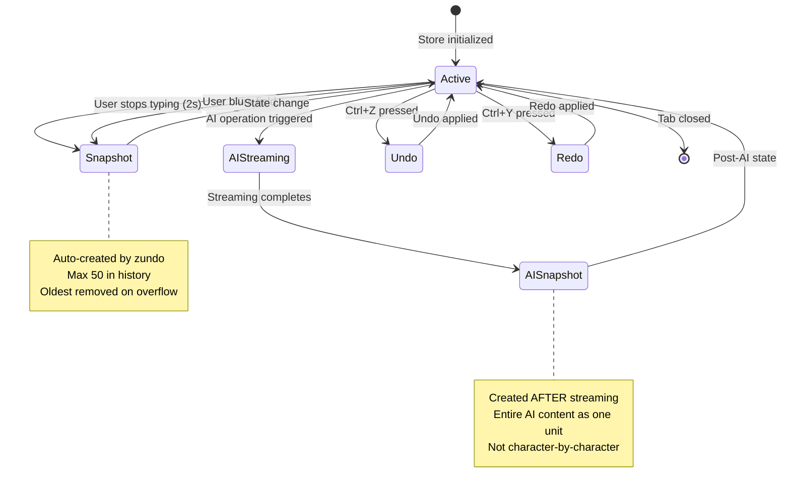

# API Contract: Draft Store with zundo Middleware

**Feature**: 007-contextual-ai-integration
**Store**: Zustand with `zundo` middleware
**Storage**: `sessionStorage` for history, `localStorage` for main draft

---

## Overview

This contract defines the enhanced draft store with undo/redo functionality using the `zundo` middleware. The store maintains history snapshots in `sessionStorage` separately from the main draft data to avoid sync conflicts.

---

## Store Configuration

### Dependencies

```bash
npm install zundo
```

### Middleware Stack

```typescript
import { create } from 'zustand';
import { persist } from 'zustand/middleware';
import { temporal } from 'zundo';
import type { TopicData } from '@/types/topic';
```

### Store Structure

```typescript
interface DraftStore {
  // State
  topicData: TopicData;

  // Actions (existing from draft-store.ts)
  setTitle: (title: string) => void;
  setHeroImage: (url: string) => void;
  setHeroQuote: (quote: string) => void;
  setMainContentEn: (content: string) => void;
  setMainContentVn: (content: string) => void;
  setVocabList: (vocab: Vocabulary[]) => void;
  addVocab: (word: Vocabulary) => void;
  removeVocab: (word: string) => void;
  updateVocab: (word: string, data: Partial<Vocabulary>) => void;
  resetTopicData: () => void;
}

// Temporal state (provided by zundo)
interface TemporalState {
  pastStates: TopicData[];
  futureStates: TopicData[];
  undo: () => void;
  redo: () => void;
  clear: () => void;
}
```

---

## Middleware Configuration

### temporal() Options

```typescript
const temporalConfig = {
  /** Maximum number of snapshots to keep (FR-016) */
  limit: 50,

  /** Only persist topicData, not design config */
  partialize: (state: DraftStore) => ({
    topicData: state.topicData,
  }),

  /** Custom persistence for undo history */
  wrapTemporal: (storeInitializer) => {
    return persist(storeInitializer, {
      name: 'draft-undo-history',
      storage: {
        getItem: (name) => {
          const str = sessionStorage.getItem(name);
          return str ? JSON.parse(str) : null;
        },
        setItem: (name, value) => {
          sessionStorage.setItem(name, JSON.stringify(value));
        },
        removeItem: (name) => sessionStorage.removeItem(name),
      },
    });
  },
};
```

### persist() Options (Main Draft)

```typescript
const persistConfig = {
  name: 'studio-card-draft',
  storage: storageConfig, // Existing localStorage config
};
```

---

## Complete Store Implementation

```typescript
// lib/stores/draft-store.ts
import { create } from 'zustand';
import { persist } from 'zustand/middleware';
import { temporal } from 'zundo';
import type { TopicData, Vocabulary } from '@/types/topic';
import { storageConfig } from '@/lib/stores/design/storage';

const defaultTopicData: TopicData = {
  title: '',
  heroImage: '',
  heroQuote: '',
  mainContentEn: '',
  mainContentVn: '',
  vocabList: [],
};

export const useDraftStore = create<DraftStore>()(
  persist(
    temporal(
      (set) => ({
        topicData: defaultTopicData,

        setTitle: (title) =>
          set((state) => ({
            topicData: { ...state.topicData, title },
          })),

        setHeroImage: (url) =>
          set((state) => ({
            topicData: { ...state.topicData, heroImage: url },
          })),

        setHeroQuote: (quote) =>
          set((state) => ({
            topicData: { ...state.topicData, heroQuote: quote },
          })),

        setMainContentEn: (content) =>
          set((state) => ({
            topicData: { ...state.topicData, mainContentEn: content },
          })),

        setMainContentVn: (content) =>
          set((state) => ({
            topicData: { ...state.topicData, mainContentVn: content },
          })),

        setVocabList: (vocabList) =>
          set((state) => ({
            topicData: { ...state.topicData, vocabList },
          })),

        addVocab: (word) =>
          set((state) => ({
            topicData: {
              ...state.topicData,
              vocabList: [...state.topicData.vocabList, word],
            },
          })),

        removeVocab: (word) =>
          set((state) => ({
            topicData: {
              ...state.topicData,
              vocabList: state.topicData.vocabList.filter((v) => v.word !== word),
            },
          })),

        updateVocab: (word, data) =>
          set((state) => ({
            topicData: {
              ...state.topicData,
              vocabList: state.topicData.vocabList.map((v) =>
                v.word === word ? { ...v, ...data } : v
              ),
            },
          })),

        resetTopicData: () => set({ topicData: defaultTopicData }),
      }),
      temporalConfig
    ),
    persistConfig
  )
);

// Access temporal state (undo/redo)
export const useDraftUndo = () => {
  return useDraftStore.temporal.getState();
};

// Reactive hook for undo state
export const useDraftTemporalState = () => {
  return useDraftStore.temporal((state) => ({
    pastStates: state.pastStates,
    futureStates: state.futureStates,
    canUndo: state.pastStates.length > 0,
    canRedo: state.futureStates.length > 0,
  }));
};
```

---

## Snapshot Creation Triggers

### 1. Debounce After Typing (FR-012)

Create snapshot 2 seconds after user stops typing:

```typescript
// In component
import { debounce } from '@/lib/stores/design/debounce-persist';
import { useDraftStore } from '@/lib/stores/draft-store';

const createSnapshot = debounce(() => {
  // zundo automatically creates snapshot on state change
  // Just need to trigger a state update
  const store = useDraftStore.getState();
  store.setTopicData({ ...store.topicData });
}, 2000);

onChange={(e) => {
  setTitle(e.target.value);
  createSnapshot();
}}
```

### 2. Field Blur (FR-013)

Create snapshot when user leaves a field:

```typescript
onBlur={() => {
  // zundo creates snapshot on state change
  const store = useDraftStore.getState();
  store.setTopicData({ ...store.topicData });
}}
```

### 3. After AI Streaming Completes (FR-014)

Create snapshot AFTER AI content is fully written:

```typescript
// In useAIStream hook
onComplete: (finalText) => {
  setField(targetField, finalText);
  // Now create snapshot with full AI content
  const store = useDraftStore.getState();
  store.setTopicData({ ...store.topicData });
  // Trigger auto-save
  triggerAutoSave();
}
```

---

## Keyboard Shortcuts

### Undo/Redo Handler

```typescript
// components/studio/KeyboardShortcuts.tsx
'use client';

import { useEffect } from 'react';
import { useDraftUndo } from '@/lib/stores/draft-store';
import { toast } from 'sonner';

export function KeyboardShortcuts() {
  const { undo, redo, pastStates, futureStates } = useDraftUndo();

  useEffect(() => {
    const handleKeyDown = (e: KeyboardEvent) => {
      // Ctrl+Z or Cmd+Z for undo
      if ((e.ctrlKey || e.metaKey) && e.key === 'z' && !e.shiftKey) {
        e.preventDefault();

        if (pastStates.length > 0) {
          undo();
          toast.info('Undo', { duration: 1000 });
        } else {
          toast.info('Nothing to undo', { duration: 1000 });
        }
      }

      // Ctrl+Y or Ctrl+Shift+Z or Cmd+Shift+Z for redo
      if (
        (e.ctrlKey || e.metaKey) &&
        (e.key === 'y' || (e.key === 'z' && e.shiftKey))
      ) {
        e.preventDefault();

        if (futureStates.length > 0) {
          redo();
          toast.info('Redo', { duration: 1000 });
        } else {
          toast.info('Nothing to redo', { duration: 1000 });
        }
      }
    };

    window.addEventListener('keydown', handleKeyDown);
    return () => window.removeEventListener('keydown', handleKeyDown);
  }, [undo, redo, pastStates.length, futureStates.length]);

  return null;
}
```

---

## Storage Architecture

### sessionStorage (Undo History)

```typescript
// Key: 'draft-undo-history'
// Content: {
//   pastStates: TopicData[],
//   futureStates: TopicData[],
//   paused: boolean
// }
// Lifecycle: Persists across tab refreshes, cleared on tab close
// Max Size: 50 snapshots
```

### localStorage (Main Draft)

```typescript
// Key: 'studio-card-draft'
// Content: TopicData
// Lifecycle: Persists indefinitely
// Sync: Syncs to Supabase for authenticated users
```

---

## State Transitions



---

## Action Types

### State Update Actions

```typescript
// Direct field updates (create snapshots via debounce/blur)
setTitle: (title: string) => void;
setHeroImage: (url: string) => void;
setHeroQuote: (quote: string) => void;
setMainContentEn: (content: string) => void;
setMainContentVn: (content: string) => void;
```

### Vocabulary Actions

```typescript
setVocabList: (vocab: Vocabulary[]) => void;
addVocab: (word: Vocabulary) => void;
removeVocab: (word: string) => void;
updateVocab: (word: string, data: Partial<Vocabulary>) => void;
```

### Undo/Redo Actions (from zundo)

```typescript
undo: () => void;     // Move to previous state
redo: () => void;     // Move to next state
clear: () => void;    // Clear all history
```

---

## Performance Considerations

| Metric | Requirement |
|--------|-------------|
| Snapshot creation | Max once per 2 seconds during typing (FR-023) |
| History size | Max 50 snapshots (FR-016) |
| Storage separation | History stored separately from draft (FR-041) |
| State sync | 500ms debounce for main draft updates (FR-020) |

---

## Testing

### Unit Tests

```typescript
// lib/stores/__tests__/draft-store.test.ts
import { renderHook, act } from '@testing-library/react';
import { useDraftStore, useDraftUndo } from '../draft-store';

describe('Draft Store with zundo', () => {
  beforeEach(() => {
    sessionStorage.clear();
    localStorage.clear();
  });

  it('should create undo snapshot after state change', () => {
    const { result } = renderHook(() => useDraftUndo());

    act(() => {
      useDraftStore.getState().setTitle('New Title');
      useDraftStore.getState().setTopicData({ ...useDraftStore.getState().topicData });
    });

    expect(result.current.pastStates.length).toBe(1);
    expect(result.current.pastStates[0].title).toBe('');
  });

  it('should undo to previous state', () => {
    act(() => {
      useDraftStore.getState().setTitle('Title 1');
      useDraftStore.getState().setTopicData({ ...useDraftStore.getState().topicData });
      useDraftStore.getState().setTitle('Title 2');
      useDraftStore.getState().setTopicData({ ...useDraftStore.getState().topicData });
    });

    const undo = useDraftStore.temporal.getState();

    act(() => undo.undo());

    expect(useDraftStore.getState().topicData.title).toBe('Title 1');
  });
});
```

---

## References

- **Specification**: [`../spec.md`](../spec.md)
- **Data Model**: [`../data-model.md`](../data-model.md)
- **Research**: [`../research.md`](../research.md) (Section 2: zundo Middleware)
- **Existing Store**: [`lib/stores/draft-store.ts`](../../../lib/stores/draft-store.ts)
- **zundo Docs**: https://github.com/charkour/zundo
