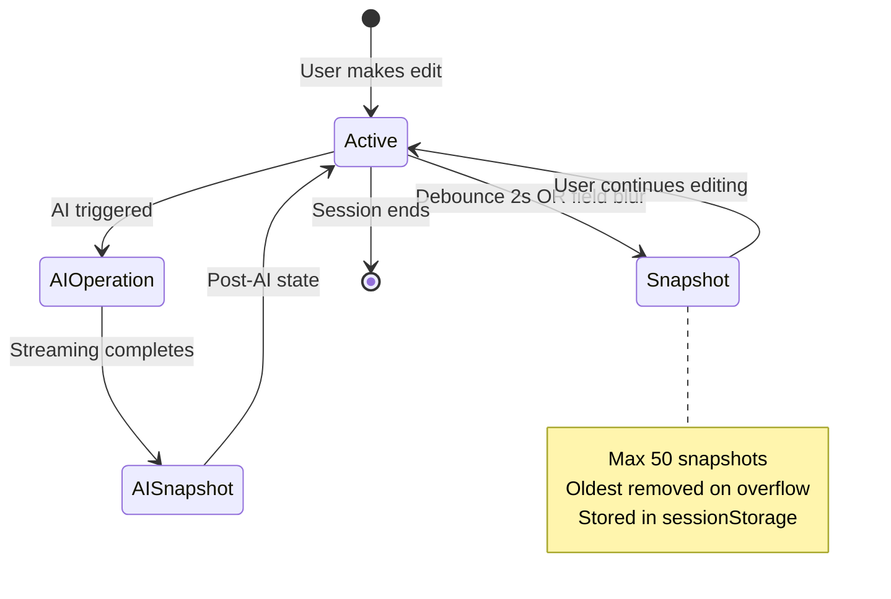
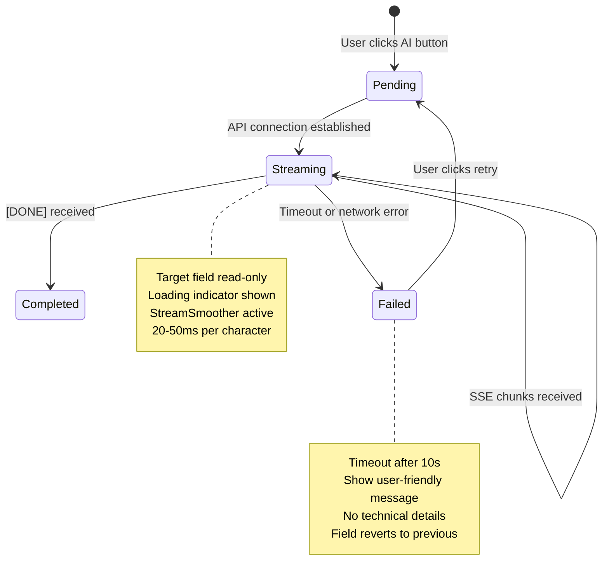
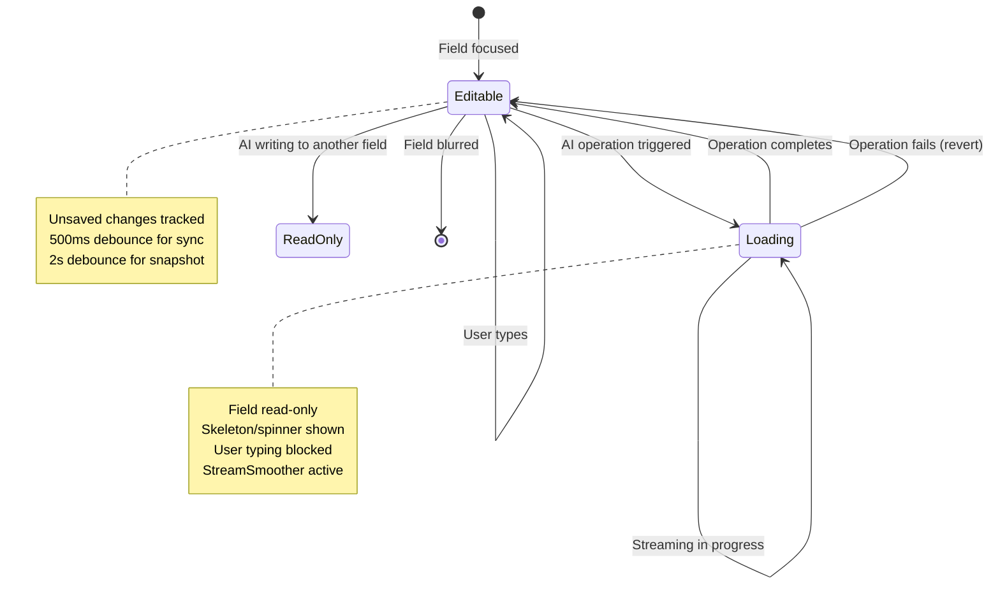
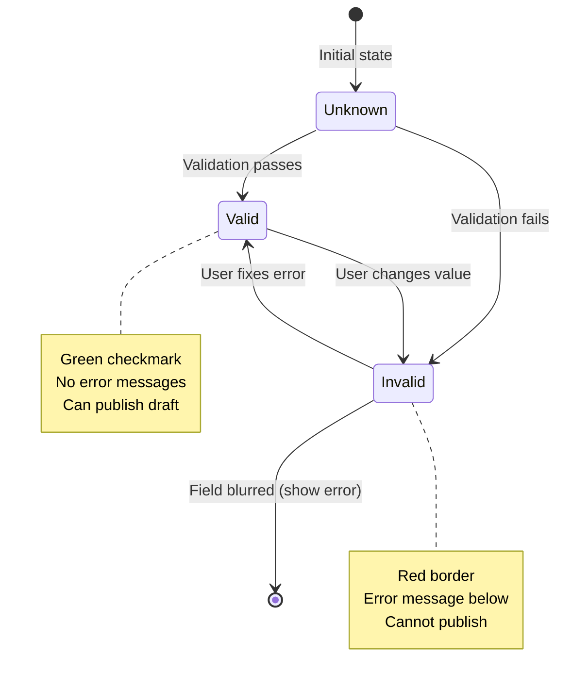
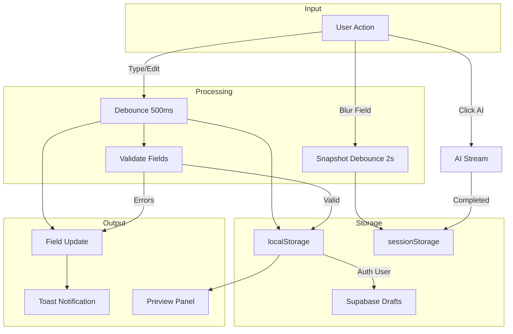

# Data Model: Contextual AI Integration for Studio

**Feature**: 007-contextual-ai-integration
**Created**: 2026-01-10
**Status**: Phase 1 Planning

## Overview

This document defines the data entities, their attributes, relationships, and validation rules for the Contextual AI Integration feature. All entities are designed to work with the existing Zustand store architecture and TypeScript strict mode.

---

## Entity Definitions

### 1. Draft Snapshot

A point-in-time capture of the entire draft state created at specific triggers for undo/redo history.

**Purpose**: Enable time-travel functionality allowing users to undo and redo changes.

**Attributes**:

| Name | Type | Description |
|------|------|-------------|
| `timestamp` | `number` | Unix epoch milliseconds when snapshot was created |
| `draftState` | `TopicData` | Complete copy of topic data at snapshot time |
| `operationType` | `OperationType` | Type of operation that triggered the snapshot |

**TypeScript Definition**:

```typescript
/**
 * Operation types that create history snapshots
 */
export type OperationType = 'edit' | 'ai-generate' | 'translate' | 'rewrite' | 'suggest';

/**
 * Draft snapshot for undo/redo history
 * Stored in sessionStorage separately from main draft data
 */
export interface DraftSnapshot {
  /** Timestamp when snapshot was created (Unix epoch ms) */
  timestamp: number;
  /** Complete topic data state at this point in time */
  draftState: TopicData;
  /** Type of operation that created this snapshot */
  operationType: OperationType;
}
```

**State Transitions**:



**Relationships**:
- One `DraftSnapshot` contains one `TopicData`
- Multiple `DraftSnapshot` entries form the undo/redo history
- Stored separately from main draft to avoid sync conflicts (FR-041)

**Validation Rules**:
- Maximum 50 snapshots per session (FR-016)
- Created after 2-second debounce during typing (FR-012)
- Created when user blurs a field (FR-013)
- Created AFTER AI streaming completes, not before (FR-014)

---

### 2. AI Operation Request

A request from the user to generate or improve content via AI with streaming response.

**Purpose**: Track AI operations through their lifecycle from initiation to completion.

**Attributes**:

| Name | Type | Description |
|------|------|-------------|
| `operationId` | `string` | Unique identifier (UUID) for this operation |
| `operationType` | `AIOperation` | Type of AI operation being performed |
| `sourceFieldId` | `keyof TopicData \| undefined` | Field to read content from (for translate/rewrite) |
| `targetFieldId` | `keyof TopicData` | Field to write generated content to |
| `timestamp` | `number` | Unix epoch milliseconds when operation was initiated |
| `status` | `AIOperationStatus` | Current status of the operation |
| `errorMessage` | `string \| null` | User-friendly error message if failed |

**TypeScript Definition**:

```typescript
/**
 * Supported AI operation types
 */
export type AIOperation =
  | 'generate-content'    // Generate from scratch (empty field)
  | 'rewrite-content'     // Improve existing content
  | 'translate-en-vn'     // English to Vietnamese
  | 'translate-vn-en'     // Vietnamese to English
  | 'suggest-topic'       // Generate topic from content
  | 'suggest-quote';      // Generate quote from content

/**
 * Status lifecycle of an AI operation
 */
export type AIOperationStatus = 'pending' | 'streaming' | 'completed' | 'failed';

/**
 * AI operation request with tracking metadata
 */
export interface AIOperationRequest {
  /** Unique identifier for this operation */
  operationId: string;
  /** Type of AI operation */
  operationType: AIOperation;
  /** Source field ID (for translate/rewrite operations) */
  sourceFieldId?: keyof TopicData;
  /** Target field ID where content will be written */
  targetFieldId: keyof TopicData;
  /** Operation initiation timestamp */
  timestamp: number;
  /** Current operation status */
  status: AIOperationStatus;
  /** User-friendly error message (null unless failed) */
  errorMessage: string | null;
}
```

**State Transitions**:



**Relationships**:
- One `AIOperationRequest` targets one `TopicData` field
- One completed operation creates one `DraftSnapshot`
- Multiple operations cannot run concurrently on same field (FR-010)

**Validation Rules**:
- Operation timeout: 10 seconds (FR-024, FR-025)
- Source field must have content for translate/rewrite (FR-008)
- Only one operation per field at a time (FR-010)
- Error messages must be user-friendly, no technical details (FR-009)

---

### 3. Field State

The current condition of an input field including loading, read-only states, and validation.

**Purpose**: Track and display the current state of each input field during editing and AI operations.

**Attributes**:

| Name | Type | Description |
|------|------|-------------|
| `fieldId` | `keyof TopicData` | Identifier of the field |
| `value` | `string` | Current field value |
| `isReadOnly` | `boolean` | Whether field is locked (during AI streaming) |
| `isLoading` | `boolean` | Whether AI operation is in progress |
| `validationErrors` | `string[]` | List of validation error messages |
| `hasUnsavedChanges` | `boolean` | Whether field has un-saved changes |

**TypeScript Definition**:

```typescript
/**
 * Runtime state of a single input field
 * Extends beyond TopicData to include UI state
 */
export interface FieldState {
  /** Field identifier matching TopicData keys */
  fieldId: keyof TopicData;
  /** Current field value */
  value: string;
  /** Field is locked during AI operations */
  isReadOnly: boolean;
  /** AI operation is in progress for this field */
  isLoading: boolean;
  /** Validation error messages (empty if valid) */
  validationErrors: string[];
  /** Changes not yet persisted to localStorage/Supabase */
  hasUnsavedChanges: boolean;
}
```

**State Transitions**:



**Relationships**:
- Each `TopicData` field has a corresponding `FieldState`
- `FieldState.validationErrors` populated by `ValidationRule` checks
- AI operations modify `FieldState.isReadOnly` and `isLoading`

**Validation Rules**:
- Title: Max 100 characters (FR-032, FR-037)
- Hero Image: Must start with `https://` and be image format (FR-033)
- Required fields: Checked on publish, not on draft save (FR-034, FR-037)

---

### 4. Validation Rule

A rule that defines acceptable input for a specific field with constraint checking.

**Purpose**: Ensure data quality and provide clear feedback for invalid inputs.

**Attributes**:

| Name | Type | Description |
|------|------|-------------|
| `fieldId` | `keyof TopicData` | Field this rule applies to |
| `ruleType` | `ValidationRuleType` | Category of validation rule |
| `constraintValue` | `string \| number` | Limit or pattern to validate against |
| `errorMessage` | `string` | User-friendly error message |

**TypeScript Definition**:

```typescript
/**
 * Validation rule types supported by the system
 */
export type ValidationRuleType =
  | 'required'      // Field must have content
  | 'format'        // Must match pattern (e.g., URL)
  | 'length';       // Must be within min/max length

/**
 * Validation rule definition
 */
export interface ValidationRule {
  /** Field identifier this rule validates */
  fieldId: keyof TopicData;
  /** Type of validation check */
  ruleType: ValidationRuleType;
  /** Constraint value (max length, regex pattern, etc.) */
  constraintValue: string | number;
  /** User-friendly error message displayed on failure */
  errorMessage: string;
}

/**
 * Validation result for a field
 */
export interface ValidationResult {
  /** Whether field passed all validation rules */
  isValid: boolean;
  /** Error messages from failed rules */
  errors: string[];
}
```

**Validation Rules by Field** (from FR-033 to FR-037):

| Field | Rule Type | Constraint | Error Message |
|-------|-----------|------------|---------------|
| `title` | length | Max 100 chars | "Title must be 100 characters or less" |
| `heroImage` | format | `^https://.*\.(jpg\|jpeg\|png\|gif\|webp\|svg)$` | "Image URL must start with https:// and be a valid image format" |
| `title` | required | On publish only | "Title is required to publish" |
| `mainContentEn` | required | On publish only | "English content is required to publish" |

**State Transitions**:



**Relationships**:
- Each `ValidationRule` applies to one `TopicData` field
- Multiple rules can apply to a single field
- Rules populate `FieldState.validationErrors`

---

## Entity Relationship Diagram

```mermaid
erDiagram
    DRAFT_SNAPSHOT ||--o| TOPIC_DATA : contains
    AI_OPERATION ||--|| TOPIC_DATA : targets
    AI_OPERATION ||--o| DRAFT_SNAPSHOT : creates
    FIELD_STATE ||o--|| TOPIC_DATA : tracks
    VALIDATION_RULE ||o--|| FIELD_STATE : validates

    DRAFT_SNAPSHOT {
        number timestamp
        TopicData draftState
        OperationType operationType
    }

    AI_OPERATION {
        string operationId
        AIOperation operationType
        string sourceFieldId
        string targetFieldId
        number timestamp
        AIOperationStatus status
        string errorMessage
    }

    FIELD_STATE {
        string fieldId
        string value
        boolean isReadOnly
        boolean isLoading
        string[] validationErrors
        boolean hasUnsavedChanges
    }

    VALIDATION_RULE {
        string fieldId
        ValidationRuleType ruleType
        string|number constraintValue
        string errorMessage
    }

    TOPIC_DATA {
        string title
        string heroImage
        string heroQuote
        string mainContentEn
        string mainContentVn
        Vocabulary[] vocabList
    }
```

---

## Storage Architecture

### sessionStorage (Undo History)
- **Key**: `draft-undo-history`
- **Content**: Array of `DraftSnapshot` objects
- **Max Size**: 50 snapshots
- **Lifecycle**: Persists across refreshes, cleared on tab close
- **Separation**: Stored separately from draft data to avoid sync conflicts

### localStorage (Main Draft)
- **Key**: `studio-card-draft`
- **Content**: Single `TopicData` object
- **Sync**: Syncs to Supabase for authenticated users
- **Existing**: Modified by existing `draft-store.ts`

### Runtime Memory (Field States)
- **Scope**: Component-level React state
- **Content**: `FieldState` for each active field
- **Persistence**: Not persisted, derived from `TopicData`

---

## Data Flow Diagram



---

## References

- **Specification**: [`spec.md`](spec.md)
- **Research**: [`research.md`](research.md)
- **Existing Types**: [`types/topic.ts`](../../types/topic.ts)
- **Existing Store**: [`lib/stores/draft-store.ts`](../../lib/stores/draft-store.ts)
