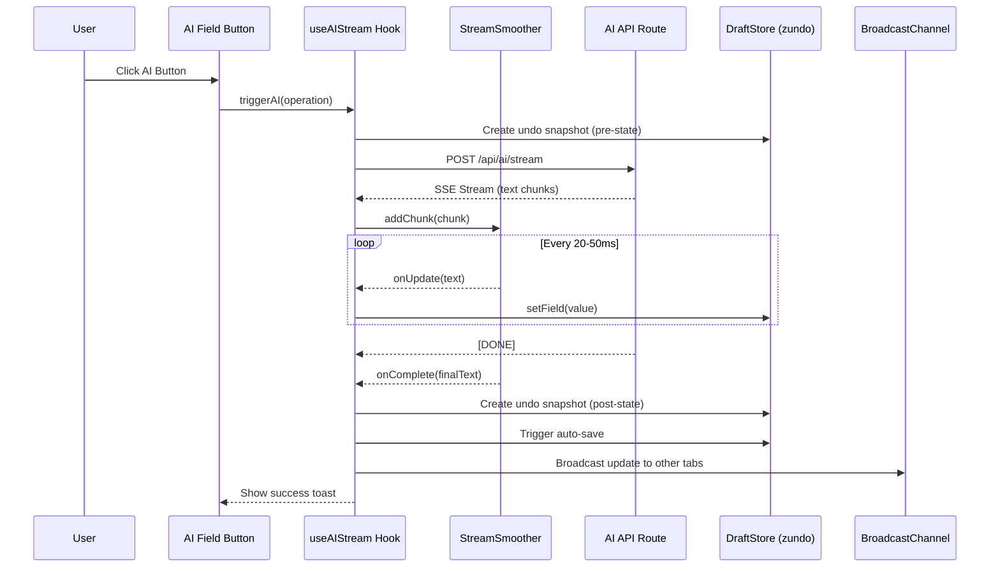

# Research Document: Contextual AI Integration for Studio

**Feature**: 007-contextual-ai-integration  
**Created**: 2026-01-10  
**Status**: Research Complete

## Overview

This document documents technical decisions and research findings for implementing contextual AI integration in the Studio editor. The feature aims to integrate AI capabilities directly into input fields with streaming responses, undo/redo functionality, and optimized performance.

---

## 1. Server-Sent Events (SSE) in Next.js 14+

### Decision
Use Next.js App Router Route Handlers with Web APIs (`ReadableStream`, `TextEncoder`) for streaming AI responses.

### Rationale
- **Native Next.js 14+ Support**: App Router supports streaming responses natively using Web APIs
- **Type Safety**: TypeScript support for streaming operations
- **Simplicity**: No additional dependencies required beyond existing AI SDK
- **Performance**: Direct streaming without intermediate libraries
- **Browser Compatibility**: Modern browsers (Chrome 90+, Firefox 88+, Safari 14+) have full support

### Alternatives Considered
1. **Pages Router API Routes with `res.writeHead`**: Rejected as project uses App Router
2. **Third-party SSE libraries (e.g., `sse.js`)**: Unnecessary overhead; native APIs sufficient
3. **WebSocket**: Overkill for unidirectional streaming; SSE is simpler and HTTP-compatible

### Implementation Notes

**Server-side (Route Handler)**:
```typescript
// app/api/ai/stream/route.ts
import { streamText } from 'ai';
import { createOpenAI } from '@ai-sdk/openai';

export async function POST(req: Request) {
  const { prompt, operation } = await req.json();
  
  const model = createOpenAI({ apiKey: process.env.OPENAI_API_KEY });
  const result = await streamText({
    model,
    prompt,
  });

  // Convert AI SDK stream to ReadableStream
  const encoder = new TextEncoder();
  const stream = new ReadableStream({
    async start(controller) {
      try {
        for await (const chunk of result.textStream) {
          controller.enqueue(encoder.encode(`data: ${JSON.stringify({ chunk })}\n\n`));
        }
        controller.enqueue(encoder.encode('data: [DONE]\n\n'));
        controller.close();
      } catch (error) {
        controller.error(error);
      }
    },
  });

  return new Response(stream, {
    headers: {
      'Content-Type': 'text/event-stream',
      'Cache-Control': 'no-store',
      'Connection': 'keep-alive',
    },
  });
}
```

**Client-side (EventSource)**:
```typescript
// lib/ai/stream-client.ts
export interface AIStreamOptions {
  onChunk: (chunk: string) => void;
  onComplete: () => void;
  onError: (error: Error) => void;
}

export function streamAIResponse(
  endpoint: string,
  payload: object,
  options: AIStreamOptions
): () => void {
  const eventSource = new EventSource(
    `${endpoint}?${new URLSearchParams(payload as Record<string, string>)}`,
    { withCredentials: true }
  );

  eventSource.onmessage = (event) => {
    if (event.data === '[DONE]') {
      options.onComplete();
      eventSource.close();
      return;
    }

    try {
      const { chunk } = JSON.parse(event.data);
      options.onChunk(chunk);
    } catch (error) {
      options.onError(error as Error);
    }
  };

  eventSource.onerror = (error) => {
    options.onError(new Error('Stream connection failed'));
    eventSource.close();
  };

  // Return cleanup function
  return () => eventSource.close();
}
```

**Gotchas**:
- EventSource doesn't support POST requests; need to use query parameters or separate fetch-based implementation
- For POST requests, use `fetch` with `ReadableStream` reader instead of EventSource
- Vercel/AWS Lambda may have timeout limits (configure appropriately)
- Need proper error handling for network interruptions

**References**:
- Existing implementation: [`app/api/generate/route.ts`](../../app/api/generate/route.ts)
- Next.js docs: https://nextjs.org/docs/app/building-your-application/routing/route-handlers#streaming

---

## 2. zundo Middleware for Zustand Undo/Redo

### Decision
Use `zundo` middleware with Zustand for time-travel undo/redo functionality.

### Rationale
- **Purpose-Built**: Specifically designed for Zustand state management
- **Minimal Footprint**: Lightweight (~1KB) compared to custom implementations
- **sessionStorage Support**: Built-in persistence for page-session history
- **TypeScript Support**: Full type safety for state and history
- **Proven**: High reputation (757 stars on GitHub), active maintenance

### Alternatives Considered
1. **Custom history implementation**: Rejected due to complexity and potential bugs
2. **Undo/Redo library (e.g., `redux-undo`)**: Designed for Redux, not Zustand
3. **Browser history API**: Not suitable for application state undo/redo

### Implementation Notes

**Installation**:
```bash
npm install zundo
```

**Store Integration**:
```typescript
// lib/stores/draft-store.ts
import { create } from 'zustand';
import { persist } from 'zustand/middleware';
import { temporal } from 'zundo';
import type { TopicData } from '@/types/topic';

interface DraftStore {
  topicData: TopicData;
  setTitle: (title: string) => void;
  setMainContentEn: (content: string) => void;
  // ... other setters
}

export const useDraftStore = create<DraftStore>()(
  persist(
    temporal(
      (set) => ({
        topicData: defaultTopicData,
        
        setTitle: (title) =>
          set((state) => ({
            topicData: { ...state.topicData, title },
          })),
        
        setMainContentEn: (content) =>
          set((state) => ({
            topicData: { ...state.topicData, mainContentEn: content },
          })),
        // ... other setters
      }),
      {
        limit: 50, // Maximum 50 snapshots as per spec
        partialize: (state) => ({ topicData: state.topicData }),
        wrapTemporal: (storeInitializer) => {
          // Persist undo history separately from draft data
          return persist(storeInitializer, {
            name: 'draft-undo-history',
            storage: {
              getItem: (name) => {
                const str = sessionStorage.getItem(name);
                return str ? JSON.parse(str) : null;
              },
              setItem: (name, value) => {
                sessionStorage.setItem(name, JSON.stringify(value));
              },
              removeItem: (name) => sessionStorage.removeItem(name),
            },
          });
        },
      }
    ),
    {
      name: 'studio-card-draft',
      storage: storageConfig, // localStorage for main draft
    }
  )
);

// Access undo/redo functions
export const useDraftUndo = () => {
  return useDraftStore.temporal.getState();
};

// Reactive hook for undo state
export const useDraftTemporalState = () => {
  return useDraftStore.temporal((state) => ({
    pastStates: state.pastStates,
    futureStates: state.futureStates,
    isUndo: state.pastStates.length > 0,
    isRedo: state.futureStates.length > 0,
  }));
};
```

**Keyboard Shortcuts**:
```typescript
// components/studio/KeyboardShortcuts.tsx
import { useEffect } from 'react';
import { useDraftUndo } from '@/lib/stores/draft-store';

export function KeyboardShortcuts() {
  const { undo, redo } = useDraftUndo();

  useEffect(() => {
    const handleKeyDown = (e: KeyboardEvent) => {
      // Ctrl+Z or Cmd+Z for undo
      if ((e.ctrlKey || e.metaKey) && e.key === 'z' && !e.shiftKey) {
        e.preventDefault();
        undo();
      }
      
      // Ctrl+Y or Ctrl+Shift+Z or Cmd+Shift+Z for redo
      if (
        (e.ctrlKey || e.metaKey) &&
        (e.key === 'y' || (e.key === 'z' && e.shiftKey))
      ) {
        e.preventDefault();
        redo();
      }
    };

    window.addEventListener('keydown', handleKeyDown);
    return () => window.removeEventListener('keydown', handleKeyDown);
  }, [undo, redo]);

  return null;
}
```

**Gotchas**:
- History must be stored separately from draft data to avoid sync conflicts (per FR-041)
- Use `sessionStorage` for history (persists across refreshes, cleared on tab close)
- Max 50 snapshots enforced via `limit` option
- AI operations create snapshot AFTER streaming completes (not before)
- Need to debounce history snapshots during continuous typing (2 seconds per spec)

**References**:
- zundo docs: https://github.com/charkour/zundo
- Existing store: [`lib/stores/draft-store.ts`](../../lib/stores/draft-store.ts)

---

## 3. Stream Smoother Mechanism

### Decision
Implement custom buffer-based stream smoother using `requestAnimationFrame` for consistent 20-50ms character rendering.

### Rationale
- **Natural Typing Feel**: Smooths out variable network latency for consistent ~1000-2000 chars/min
- **Performance**: Uses `requestAnimationFrame` for 60fps rendering
- **Simplicity**: Custom implementation avoids external dependencies
- **Control**: Full control over buffering and rendering speed

### Alternatives Considered
1. **Raw SSE rendering**: Causes jerky, uneven text appearance due to network variability
2. **Fixed interval setInterval**: Less efficient than `requestAnimationFrame`
3. **CSS animations**: Cannot control content timing

### Implementation Notes

**StreamSmoother Class**:
```typescript
// lib/ai/stream-smoother.ts
export interface StreamSmootherOptions {
  charsPerMinute: number; // Target speed (default: 1500 = ~25ms per char)
  onUpdate: (text: string) => void;
  onComplete: (finalText: string) => void;
}

export class StreamSmoother {
  private buffer: string[] = [];
  private currentText = '';
  private isProcessing = false;
  private rafId: number | null = null;
  private lastRenderTime = 0;
  private readonly charsPerMinute: number;
  private readonly onUpdate: (text: string) => void;
  private readonly onComplete: (finalText: string) => void;
  private readonly msPerChar: number;

  constructor(options: StreamSmootherOptions) {
    this.charsPerMinute = options.charsPerMinute ?? 1500;
    this.onUpdate = options.onUpdate;
    this.onComplete = options.onComplete;
    this.msPerChar = 60000 / this.charsPerMinute;
  }

  addChunk(chunk: string): void {
    this.buffer.push(chunk);
    if (!this.isProcessing) {
      this.startProcessing();
    }
  }

  private startProcessing(): void {
    this.isProcessing = true;
    this.processNext();
  }

  private processNext = (): void => {
    if (this.buffer.length === 0) {
      this.isProcessing = false;
      this.onComplete(this.currentText);
      return;
    }

    const now = performance.now();
    const timeSinceLastRender = now - this.lastRenderTime;

    if (timeSinceLastRender >= this.msPerChar) {
      const nextChar = this.buffer.shift();
      if (nextChar) {
        this.currentText += nextChar;
        this.onUpdate(this.currentText);
        this.lastRenderTime = now;
      }
    }

    this.rafId = requestAnimationFrame(this.processNext);
  };

  stop(): void {
    if (this.rafId !== null) {
      cancelAnimationFrame(this.rafId);
      this.rafId = null;
    }
    this.isProcessing = false;
    this.buffer = [];
  }

  reset(): void {
    this.stop();
    this.currentText = '';
    this.lastRenderTime = 0;
  }
}
```

**React Hook Integration**:
```typescript
// hooks/useStreamSmoother.ts
import { useState, useCallback, useRef } from 'react';
import { StreamSmoother } from '@/lib/ai/stream-smoother';

export function useStreamSmoother(charsPerMinute = 1500) {
  const [text, setText] = useState('');
  const [isStreaming, setIsStreaming] = useState(false);
  const smootherRef = useRef<StreamSmoother | null>(null);

  const startStreaming = useCallback(() => {
    if (smootherRef.current) {
      smootherRef.current.reset();
    }

    smootherRef.current = new StreamSmoother({
      charsPerMinute,
      onUpdate: setText,
      onComplete: (finalText) => {
        setText(finalText);
        setIsStreaming(false);
      },
    });
    setIsStreaming(true);
  }, [charsPerMinute]);

  const addChunk = useCallback((chunk: string) => {
    smootherRef.current?.addChunk(chunk);
  }, []);

  const stopStreaming = useCallback(() => {
    smootherRef.current?.stop();
    setIsStreaming(false);
  }, []);

  return {
    text,
    isStreaming,
    startStreaming,
    addChunk,
    stopStreaming,
  };
}
```

**Gotchas**:
- Must handle cleanup on component unmount to prevent memory leaks
- Buffer may grow if rendering lags; implement max buffer size if needed
- Test on low-end devices to ensure performance
- Adjust `charsPerMinute` based on user feedback

---

## 4. Debounce Patterns

### Decision
Reuse existing [`debounce`](../../lib/stores/design/debounce-persist.ts:13) utility from [`lib/stores/design/debounce-persist.ts`](../../lib/stores/design/debounce-persist.ts).

### Rationale
- **Already Implemented**: Codebase has working debounce utility
- **Tested**: Existing implementation is proven
- **Consistent**: Maintains code patterns across project

### Implementation Notes

**Existing Implementation**:
```typescript
// Already exists in lib/stores/design/debounce-persist.ts
export function debounce<T extends (...args: unknown[]) => void>(
  func: T,
  delay: number = 500
): (...args: Parameters<T>) => void {
  let timeoutId: NodeJS.Timeout | null = null;

  return (...args: Parameters<T>) => {
    if (timeoutId) {
      clearTimeout(timeoutId);
    }
    timeoutId = setTimeout(() => {
      func(...args);
      timeoutId = null;
    }, delay);
  };
}
```

**Usage for State Sync (500ms)**:
```typescript
// In component
const debouncedUpdate = debounce(
  (value: string) => {
    setMainContentEn(value);
    triggerAutoSave();
  },
  500
);

onChange={(e) => debouncedUpdate(e.target.value)}
```

**Usage for History Snapshots (2s)**:
```typescript
const debouncedSnapshot = debounce(() => {
  createHistorySnapshot();
}, 2000);

onChange={(e) => {
  setValue(e.target.value);
  debouncedSnapshot();
}}
```

**Gotchas**:
- Use separate debounce instances for different purposes
- Clear debounce timers on component unmount
- History snapshot debounce (2s) is longer than state sync debounce (500ms)

**References**:
- Existing utility: [`lib/stores/design/debounce-persist.ts`](../../lib/stores/design/debounce-persist.ts)

---

## 5. Lucide React Icons

### Decision
Use existing `lucide-react` package (already installed: `^0.562.0`).

### Rationale
- **Already Installed**: No additional dependency needed
- **Project Standard**: Already used across the codebase
- **Tree Shakable**: Only imports used icons
- **TypeScript Support**: Full type definitions

### Implementation Notes

**Required Icons**:
```typescript
import { 
  Sparkles,      // Magic Fill / Generate suggestions
  PenLine,       // Rewrite / Fix Grammar
  Languages,     // Auto Translate
} from 'lucide-react';
```

**Button Components**:
```typescript
// components/ai/AIFieldButton.tsx
import { Button } from '@/components/ui/button';
import { Sparkles, PenLine, Languages, Loader2 } from 'lucide-react';

interface AIFieldButtonProps {
  operation: 'generate' | 'rewrite' | 'translate';
  isLoading?: boolean;
  disabled?: boolean;
  onClick: () => void;
}

const icons = {
  generate: Sparkles,
  rewrite: PenLine,
  translate: Languages,
};

export function AIFieldButton({ operation, isLoading, disabled, onClick }: AIFieldButtonProps) {
  const Icon = icons[operation];
  
  return (
    <Button
      variant="ghost"
      size="sm"
      onClick={onClick}
      disabled={disabled || isLoading}
      className="ml-2"
    >
      {isLoading ? (
        <Loader2 className="h-4 w-4 animate-spin" />
      ) : (
        <Icon className="h-4 w-4" />
      )}
    </Button>
  );
}
```

**Gotchas**:
- None; straightforward implementation

---

## 6. BroadcastChannel API for Cross-Tab Sync

### Decision
Implement BroadcastChannel API for real-time cross-tab synchronization of draft changes.

### Rationale
- **Native Browser API**: No external dependencies
- **Simple**: Pub/sub pattern for same-origin communication
- **Efficient**: Direct tab-to-tab communication without server
- **Spec Requirement**: Required by FR-042

### Current Status
**NEEDS CLARIFICATION**: Spec references BroadcastChannel but no existing implementation found. This feature was marked as "future enhancement" in spec 003-cloud-sync-autosave.

### Implementation Plan

**Channel Manager**:
```typescript
// lib/sync/draft-sync-channel.ts
export interface DraftSyncMessage {
  type: 'update' | 'conflict';
  timestamp: number;
  tabId: string;
  data?: TopicData;
}

export class DraftSyncChannel {
  private channel: BroadcastChannel;
  private tabId: string;
  private listeners: Set<(message: DraftSyncMessage) => void> = new Set();

  constructor(channelName = 'draft-sync') {
    this.channel = new BroadcastChannel(channelName);
    this.tabId = crypto.randomUUID();
    
    this.channel.onmessage = (event) => {
      this.notifyListeners(event.data);
    };
  }

  private notifyListeners(message: DraftSyncMessage): void {
    // Ignore messages from this tab
    if (message.tabId === this.tabId) return;
    
    this.listeners.forEach((listener) => listener(message));
  }

  broadcast(data: TopicData): void {
    const message: DraftSyncMessage = {
      type: 'update',
      timestamp: Date.now(),
      tabId: this.tabId,
      data,
    };
    this.channel.postMessage(message);
  }

  subscribe(listener: (message: DraftSyncMessage) => void): () => void {
    this.listeners.add(listener);
    return () => this.listeners.delete(listener);
  }

  close(): void {
    this.channel.close();
  }
}
```

**Integration with Store**:
```typescript
// In draft-store middleware
const syncChannel = new DraftSyncChannel();

// Subscribe to external changes
syncChannel.subscribe((message) => {
  if (message.type === 'update' && message.data) {
    // Show conflict notification
    toast.info('Changes from another tab detected');
    // Merge or replace based on timestamp
    if (message.timestamp > lastLocalUpdate) {
      set({ topicData: message.data });
    }
  }
});

// Broadcast local changes
persist: {
  onRehydrateStorage: () => (state) => {
    state.subscribe((newState) => {
      syncChannel.broadcast(newState.topicData);
    });
  }
}
```

**Gotchas**:
- BroadcastChannel only works for same-origin tabs
- Need unique tab IDs to avoid echo effects
- Handle channel closure on tab unload
- Last-write-wins semantics with timestamp comparison
- Test with multiple tabs extensively

---

## 7. AI Operation Types & Prompts

### Decision
Define operation types (generate, rewrite, translate, suggest) with specific prompts for each.

### Rationale
- **Clear Separation**: Each operation has distinct purpose
- **Optimized Prompts**: Tailored prompts for better results
- **Extensible**: Easy to add new operation types

### Implementation Notes

**Operation Types**:
```typescript
// lib/ai/operations.ts
export type AIOperation = 
  | 'generate-content'    // Generate from scratch
  | 'rewrite-content'     // Improve existing content
  | 'translate-en-vn'     // English to Vietnamese
  | 'translate-vn-en'     // Vietnamese to English
  | 'suggest-topic'       // Generate topic from content
  | 'suggest-quote';      // Generate quote from content

export interface AIOperationConfig {
  operation: AIOperation;
  sourceField?: keyof TopicData;
  targetField: keyof TopicData;
  prompt: (content: string) => string;
}

export const AI_OPERATIONS: Record<AIOperation, AIOperationConfig> = {
  'generate-content': {
    operation: 'generate-content',
    targetField: 'mainContentEn',
    prompt: () => 'Generate an educational English text about a topic suitable for English learners...',
  },
  'rewrite-content': {
    operation: 'rewrite-content',
    sourceField: 'mainContentEn',
    targetField: 'mainContentEn',
    prompt: (content) => `Improve and rewrite the following text while maintaining the original meaning. Fix grammar and enhance clarity:\n\n${content}`,
  },
  'translate-en-vn': {
    operation: 'translate-en-vn',
    sourceField: 'mainContentEn',
    targetField: 'mainContentVn',
    prompt: (content) => `Translate the following English text to natural Vietnamese:\n\n${content}`,
  },
  'translate-vn-en': {
    operation: 'translate-vn-en',
    sourceField: 'mainContentVn',
    targetField: 'mainContentEn',
    prompt: (content) => `Translate the following Vietnamese text to natural English:\n\n${content}`,
  },
  'suggest-topic': {
    operation: 'suggest-topic',
    sourceField: 'mainContentEn',
    targetField: 'title',
    prompt: (content) => `Analyze the following text and generate a concise, descriptive title (max 100 characters):\n\n${content}`,
  },
  'suggest-quote': {
    operation: 'suggest-quote',
    sourceField: 'mainContentEn',
    targetField: 'heroQuote',
    prompt: (content) => `Extract or generate an inspirational quote related to the following text:\n\n${content}`,
  },
};
```

---

## 8. Performance Considerations

### Key Metrics
- **Streaming Speed**: 20-50ms per character (~1000-2000 chars/min)
- **Input Latency**: <16ms (60fps) for keystrokes
- **Debounce Times**:
  - State sync: 500ms
  - History snapshots: 2000ms (2s)
- **AI Timeout**: 10 seconds (fail fast)

### Optimization Strategies
1. **Render Optimization**:
   - Use React.memo for AI button components
   - Batch state updates during streaming
   - Debounce preview panel updates

2. **Memory Management**:
   - Limit history to 50 snapshots
   - Clear undo history on new edits after undo
   - Cleanup EventSource connections on unmount

3. **Network Efficiency**:
   - Reuse existing AI SDK (`ai` package v6.0.23)
   - Implement timeout handling (10s)
   - Graceful degradation on network errors

---

## 9. Error Handling Strategy

### User-Facing Messages (No Technical Details)
```typescript
const ERROR_MESSAGES = {
  timeout: 'AI service is taking longer than expected. Please try again.',
  network: 'Unable to connect to AI service. Please check your connection.',
  rate_limit: 'Too many requests. Please wait a moment and try again.',
  api_key: 'AI service configuration error. Please contact support.',
  default: 'AI service unavailable. Please try again.',
};

function getErrorMessage(error: Error): string {
  // Map technical errors to user-friendly messages
  if (error.name === 'AbortError') return ERROR_MESSAGES.timeout;
  if (error.message.includes('fetch')) return ERROR_MESSAGES.network;
  // ... other mappings
  
  return ERROR_MESSAGES.default;
}
```

### Error Recovery
- Show toast notification with retry button
- Revert field to previous state on error
- Log technical errors separately for debugging
- Never expose stack traces or API keys to users

---

## 10. Testing Strategy

### Unit Tests
- StreamSmoother timing accuracy
- Debounce function behavior
- zundo history state transitions
- AI operation prompt generation

### Integration Tests
- SSE connection lifecycle
- EventSource cleanup
- Cross-tab sync via BroadcastChannel
- Undo/redo keyboard shortcuts

### E2E Scenarios
- User triggers AI operation and sees streaming
- User types rapidly without lag
- User undoes AI-generated content
- Two tabs edit same draft simultaneously

---

## 11. Dependencies

### New Dependencies Required
```bash
npm install zundo
```

### Existing Dependencies Used
- `zustand`: ^5.0.9 (state management)
- `ai`: ^6.0.23 (AI SDK with streaming)
- `lucide-react`: ^0.562.0 (icons)
- `sonner`: ^2.0.7 (toast notifications)
- `react`: 19.2.3 (React 19)

### No Additional Dependencies Needed For
- SSE (native Web APIs)
- BroadcastChannel (native browser API)
- Debounce (existing utility)
- StreamSmoother (custom implementation)

---

## 12. Unresolved Clarifications

### NEEDS CLARIFICATION: BroadcastChannel Implementation
**Status**: Spec references BroadcastChannel for cross-tab sync (FR-042), but this was marked as "future enhancement" in spec 003-cloud-sync-autosave. No existing implementation found.

**Decision Required**: Should this feature be implemented as part of 007, or deferred to a future feature?

**Recommendation**: Implement basic BroadcastChannel sync with last-write-wins semantics and conflict notifications. This is a relatively low-effort addition that provides significant value for users who work across multiple tabs.

---

## 13. Architecture Diagram



---

## 14. Implementation Checklist

### Phase 1: Core Infrastructure
- [ ] Install and configure zundo middleware
- [ ] Create StreamSmoother utility
- [ ] Set up SSE streaming route handler
- [ ] Implement useAIStream React hook

### Phase 2: UI Components
- [ ] Create AIFieldButton component with Lucide icons
- [ ] Add loading states and animations
- [ ] Implement inline field integration
- [ ] Add keyboard shortcuts (Ctrl+Z, Ctrl+Y)

### Phase 3: Integration
- [ ] Integrate zundo with draft-store.ts
- [ ] Wire up AI operation types and prompts
- [ ] Connect StreamSmoother to field updates
- [ ] Implement error handling and retry logic

### Phase 4: Cross-Tab Sync
- [ ] Implement BroadcastChannel manager
- [ ] Add conflict detection and notifications
- [ ] Test multi-tab scenarios

### Phase 5: Testing & Polish
- [ ] Write unit tests for critical components
- [ ] Performance test on low-end devices
- [ ] Verify streaming speed (20-50ms per char)
- [ ] Test undo/redo with AI operations
- [ ] Accessibility testing

---

## 15. Confidence Assessment

| Technical Area | Confidence Level | Notes |
|---|---|---|
| SSE in Next.js 14+ | **High** | Well-documented, native support |
| zundo middleware | **High** | Purpose-built library, good docs |
| StreamSmoother | **Medium** | Custom implementation, needs testing |
| Debounce patterns | **High** | Existing proven implementation |
| Lucide icons | **High** | Already installed, straightforward |
| BroadcastChannel | **Medium** | Native API but needs implementation |

**Overall Confidence**: **High** - All technical areas have clear implementation paths with proven solutions. The main uncertainty is around BroadcastChannel which requires new implementation but uses standard browser APIs.

---

## References

### Codebase References
- Existing AI endpoint: [`app/api/generate/route.ts`](../../app/api/generate/route.ts)
- Draft store: [`lib/stores/draft-store.ts`](../../lib/stores/draft-store.ts)
- Debounce utility: [`lib/stores/design/debounce-persist.ts`](../../lib/stores/design/debounce-persist.ts)
- Feature spec: [`specs/007-contextual-ai-integration/spec.md`](spec.md)

### External Documentation
- Next.js Route Handlers: https://nextjs.org/docs/app/building-your-application/routing/route-handlers
- zundo: https://github.com/charkour/zundo
- Vercel AI SDK: https://sdk.vercel.ai/docs
- BroadcastChannel API: https://developer.mozilla.org/en-US/docs/Web/API/BroadcastChannel
- Server-Sent Events: https://developer.mozilla.org/en-US/docs/Web/API/Server-sent_events

---

## 16. Critical Implementation Notes

This section contains important technical feedback to prevent bugs during implementation.

### 16.1 Mobile UI - Buttons Overlapping Text

**Issue** / **Vấn đề**: FR-027 places AI buttons "inline on the right side" which could cause text to wrap under buttons or be hidden on mobile screens.

**Solution** / **Giải pháp**: Ensure Input/Textarea has sufficient padding-right (e.g., `pr-20` or `pr-16`) to reserve space for absolutely positioned button groups.

**Implementation Details** / **Chi tiết triển khai**:
```css
/* Add padding to prevent text overlap with AI buttons */
textarea.ai-enabled {
  padding-right: 5rem; /* pr-20 = 80px for button group */
}

/* Mobile-specific adjustment */
@media (max-width: 640px) {
  textarea.ai-enabled {
    padding-right: 4rem; /* pr-16 = 64px for smaller button group */
  }
}
```

**Related Tasks**: T016, T017, T018

---

### 16.2 BroadcastChannel & Race Conditions

**Issue** / **Vấn đề**: Infinite loop risk - Tab A sends → Tab B receives → Tab B updates store → Tab B broadcasts → Tab A receives...

**Solution** / **Giải pháp**: The `if (message.tabId === this.tabId) return;` check is good, but ensure when Tab B receives an update, it updates the Store with a `silent: true` flag or similar logic to prevent re-broadcasting to the channel.

**Implementation Details** / **Chi tiết triển khai**:
```typescript
// lib/sync/draft-sync-channel.ts
export interface DraftSyncMessage {
  type: 'update' | 'conflict';
  timestamp: number;
  tabId: string;
  data?: TopicData;
  silent?: boolean; // NEW: Prevent re-broadcast
}

// In store middleware
syncChannel.subscribe((message) => {
  if (message.type === 'update' && message.data) {
    // Update store WITHOUT triggering broadcast
    useDraftStore.setState({ topicData: message.data }, true); // silent flag
  }
});

// In persist middleware - only broadcast if not from sync
onRehydrateStorage: () => (state) => {
  state.subscribe((newState, oldState) => {
    // Don't broadcast if this update came from another tab
    if (oldState?._syncSource) return; // Skip broadcast
    
    syncChannel.broadcast(newState.topicData);
  });
}
```

**Related Tasks**: T008, T085, T086

---

### 16.3 Zustand Debounce vs. React Updates

**Issue** / **Vấn đề**: Using debounce 500ms to sync state could cause lag if Input Value is bound directly to Store (especially with heavy middleware like zundo).

**Solution** / **Giải pháp**: Use Local State (React useState) for immediate display (16ms latency target), then push to Store via debounce. Test T064 thoroughly on low-end devices.

**Implementation Details** / **Chi tiết triển khai**:
```typescript
// components/studio/GridField.tsx
function ContentField() {
  const [localValue, setLocalValue] = useState(''); // Immediate UI
  const storeValue = useDraftStore((s) => s.topicData.mainContentEn);
  const debouncedUpdate = useDebouncedUpdate(); // Custom hook

  useEffect(() => {
    setLocalValue(storeValue); // Sync store -> local on mount/external changes
  }, [storeValue]);

  const handleChange = (value: string) => {
    setLocalValue(value); // Immediate UI update (~16ms)
    debouncedUpdate(value); // Debounced store sync (500ms)
  };

  return (
    <Textarea
      value={localValue} // Use local state for binding
      onChange={(e) => handleChange(e.target.value)}
    />
  );
}
```

**Performance Target** / **Mục tiêu hiệu năng**:
- Input latency: <16ms (60fps)
- Debounced store sync: 500ms
- Test on: Low-end devices, mobile browsers

**Related Tasks**: T054, T064

---

**Document Version**: 1.1
**Last Updated**: 2026-01-10
**Research Completed By**: Architect Mode
